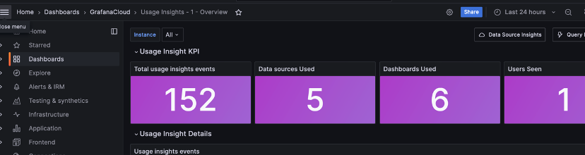

# A continuación se describe el paso a paso en la creación del dashboard que muestra las  ventas del  Whole Foods Market en tiempo real:

Project 01
1. Creación de VM para las tiendas:

2. Creación de Bucket de donde tomaremos los mensajes.

3.	Creación de permisos en el project02:

4. Creación de tablas en SQL con las características necesarias:

5. Secrets y e ingreso de store_data_into_cloud_sql:

6.	Generación de repositorios en Artifact Registry: 

7.	Cloud Run: Creación de servicios:

8.	Generadores corriendo:

8.	Conexión a Grafana:

