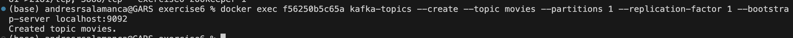
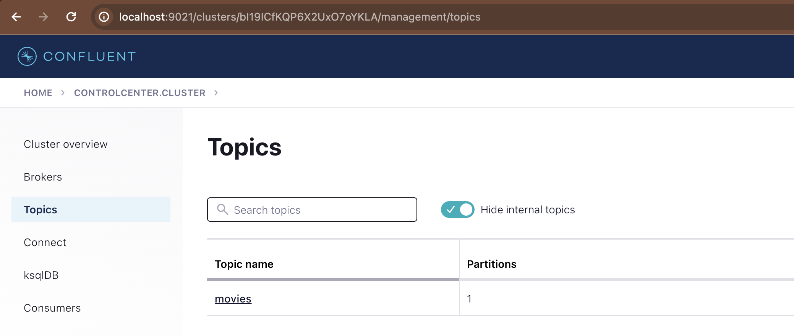
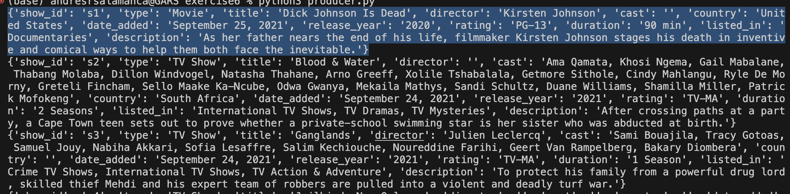
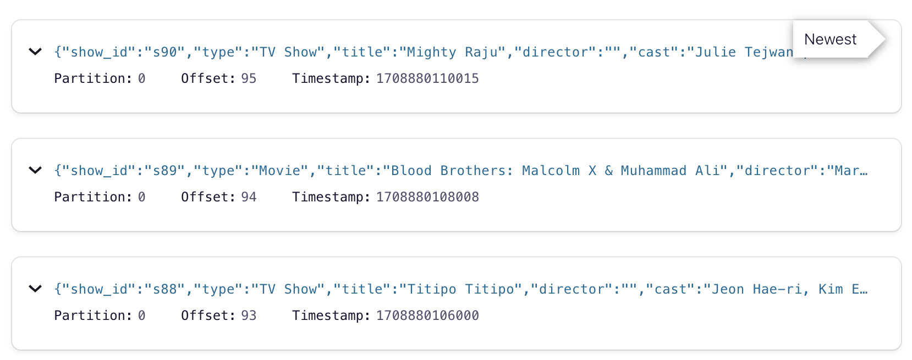
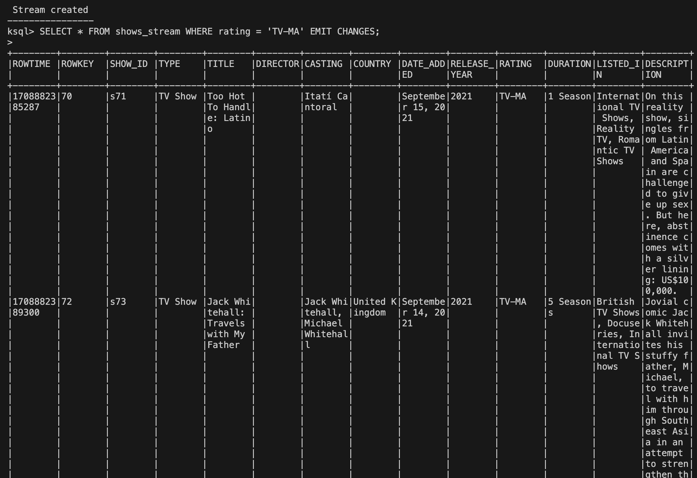
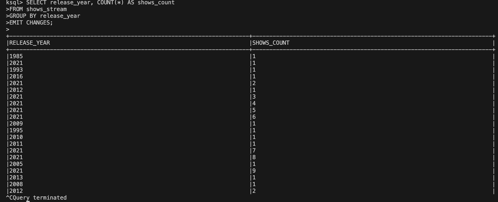
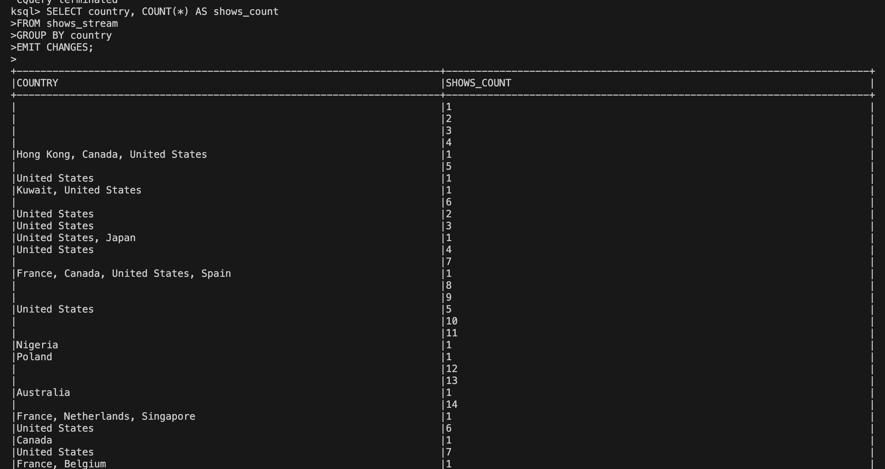

# Entregable Kafka
## Post Work: Data Processing with Kafka end to end

1.El fichero con el que se realizó este entregable es Netflix.csv disponible en https://www.kaggle.com/datasets (adjunto) con las siguientes columnas:

•	show_id
•	title
•	director	cast
•	country	
•	date_added
•	release_year
•	rating
•	duration
•	listed_in
•	description
•	type
•	year_added
•	month_added
•	season_count

1. Creacion del Topic:

2. Generacion de mensajes (producer):

2.1 Los mensajes tiene la siguiente estructura JSON:

3.  Inicio sesion KSQL y creo un Stream:

A partir de la informacion que se produce podemos encontrar informacion de valor como:

3.1 Conocer que tipo de peliculas se estan consumiendo a partir del Rating:

3.2 Conocer a partir del año de realizacion que  peliculas se estan consumiendo:

3.3 Conocer de que paises (count) son las peliculas se estan consumiendo:

