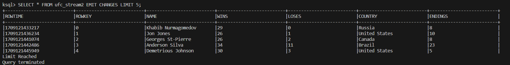
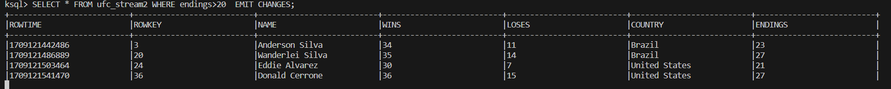
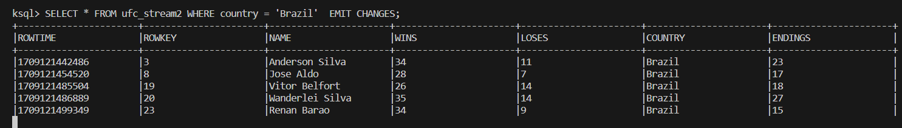

# Postwork Kafka
Para este entregable he usado un json con los mejores peleadores de la UFC a lo largo de la historía, en el que encontramos su nombre, sus victorías, sus derrotas, las finalizaciones que han conseguido a lo largo de su carrera profesional y su pais.
El json tinen la forma:

```json
{
  "fighters": [
    {
      "name": "X",
      "wins": "X",
      "loses": "X",
      "country": "X",
      "endings": "X"
    }
```

El caso de uso que vamos a implentar sirve para poder buscar y filtrar los luchadores por las diferentes estadisticas que tenemos de cada uno de ellos, como podemos ver en las consultas ksql que he adjuntado a continuación:





