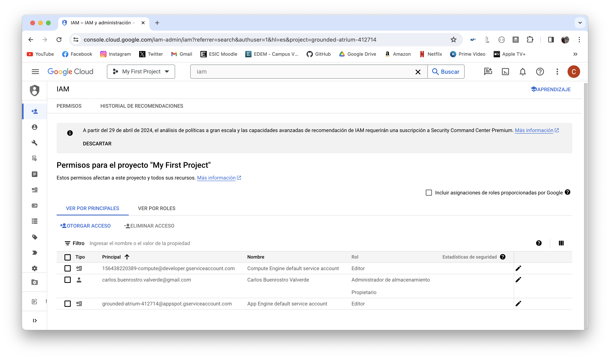
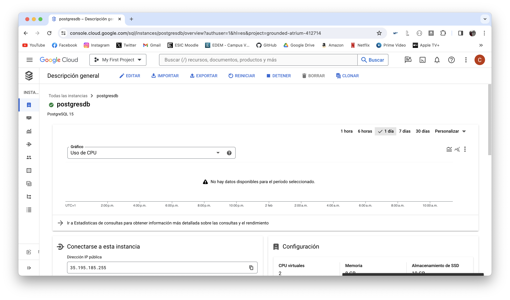
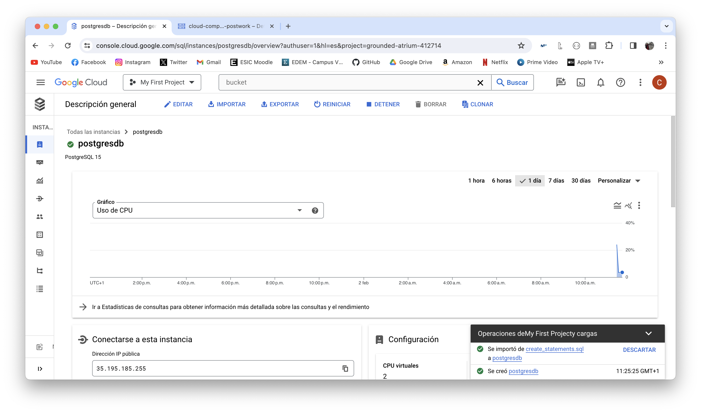
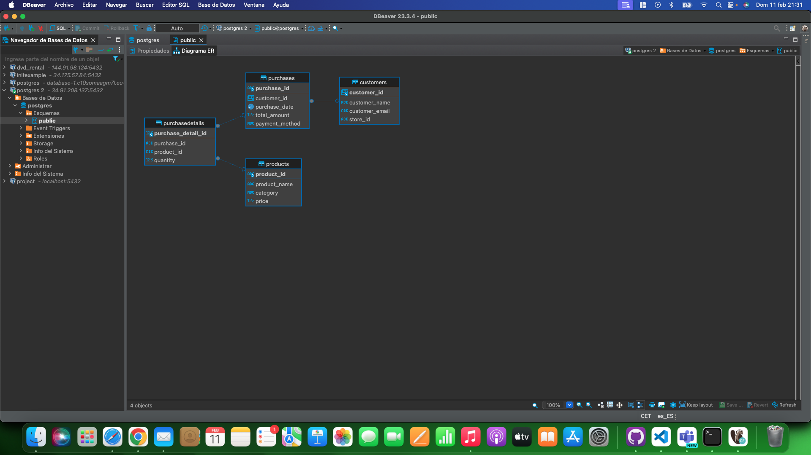
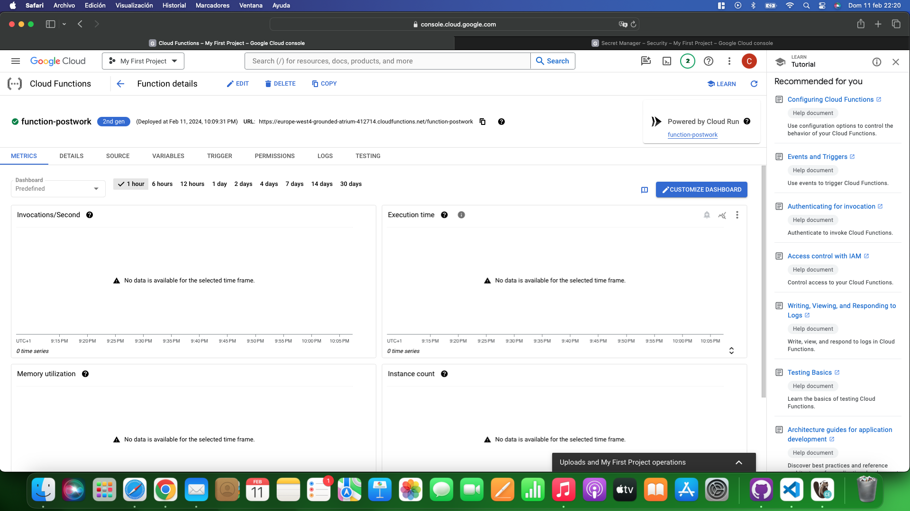
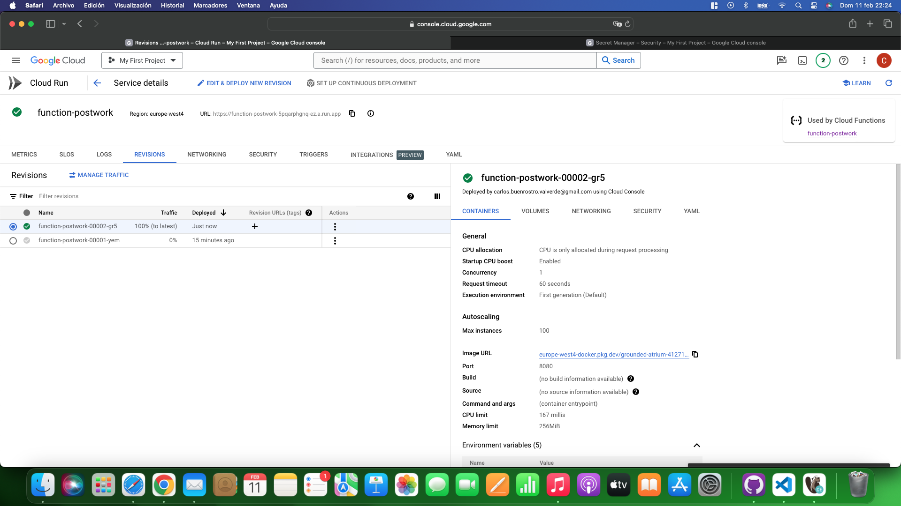
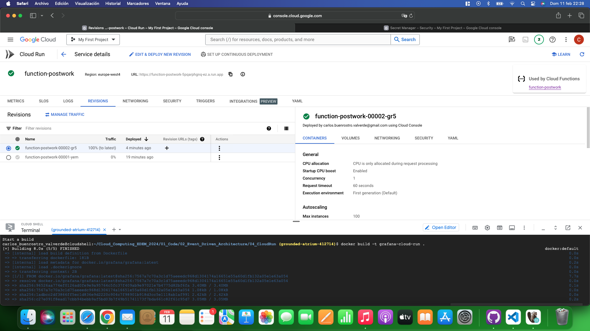
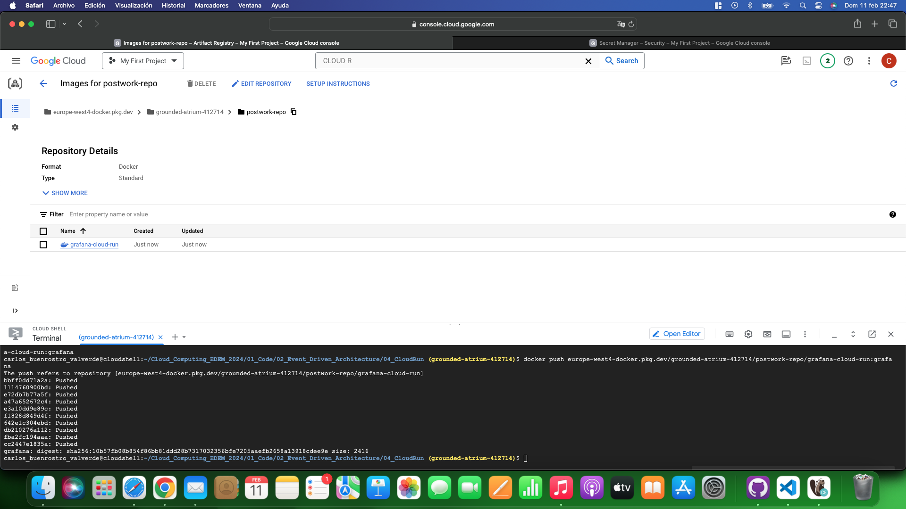
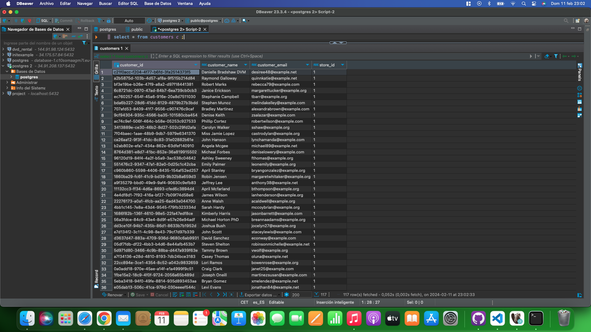
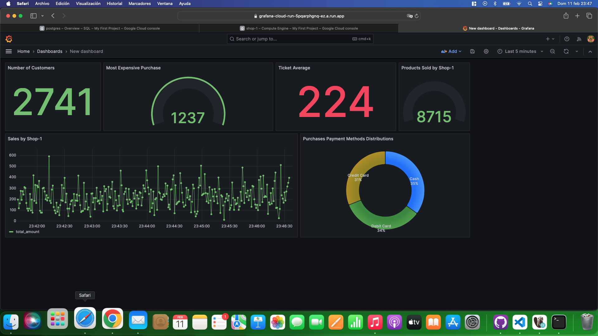

# CLOUD COMPUTING - END2END

A continuación expongo el proceso llevado a cabo para la realización de este Postwork.

En primer lugar, iniciamos la sesion a través de la terminal de nuestro ordenador y ejecutamos los diferentes comandos de gcloud SDK para activar las APIs necesarias para el trabajo.  Seguidamente, creamos la Virtual Machine en la plataforma [Google Cloud Platform](https://cloud.google.com). A través de Virtual Machines Instances.

Una vez la máquina virtual se encuentra levantada, debemos crear el bucket en el cual almacenaremos los archivos necesarios para la creación de tablas en SQL. 

En nuestra cuenta principal deberemos garantizar los diferentes accesos para poder trabajar. En este caso activamos el rol de Administrador de almacenamiento.

El siguiente paso a realizar será la creación de la Base de Datos en PostgreSQL. Para ello, se deberá acceder en la barra de búsqueda a SQL y comenzar a configurar la BBDD deseada. 

Cuando se haya generado la instancia de SQL, tendremos que subir al bucket creado el archivo de creación de tablas; y este tiene que ser importado por la instancia SQL.  

El siguiente paso a seguir es la conexión con la instancia para poder visualizar las tablas por consola. A continuación se puede observar ambas: 
 

Cuando sean visibles estas tablas, se pasará a realizar la conexión con DBeaver para la visualización de la BBDD. 

**En este caso, como daba muchos problemas el Proxy, he conectado a través de la IP Pública de la instancia SQL de GCP**

**Queda pendiente cerrar una reunión con Miguel para poder solucionar esta parte y de esta forma poder realizar la conexión a través de Proxy**

A continuación, se crearán los secrets a través del Secret Manager de GCP que serán necesarios para la creación de la Cloud Function. 

Más tarde, se accede a la consola de Cloud Function para poder crear la funcion. Tras la creación de la misma, se debe acceder a Cloud Run service para hacer la conexión con la instancia de SQL que se ha creado.

A través de la Cloud Shell, se ha creado la imagen docker que permitirá ejecutar Grafana para la realización y visualización de los datos procesados. Esta debe de ser enviada al repositorio creado en Artifact Registry

Se configura seguidamente el Cloud Run Service. 

En uno de los últimos pasos a seguir en la configuración del entorno será ejecutado el generador de datos. Para comprobar que los datos han seguido el flujo correcto, desde DBeaver se pueden realizar las diferentes queries necesarias para corroborar que los datos procesados están llegando.

Por último, se accederá a Grafana. En este paso se deberán configurar las conexiones a la BBDD. Una vez se tenga la configuración realizada, se podrá comenzar con la creación del dashboard para plasmar los mejores datos y métricas del proyecto.

