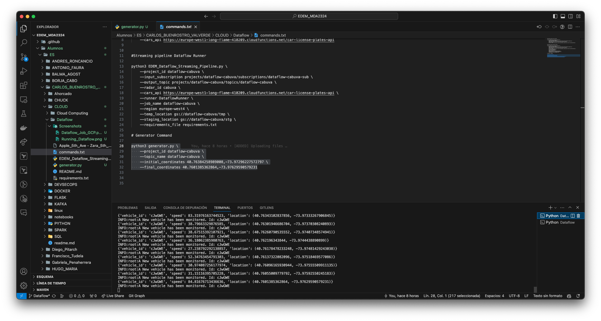
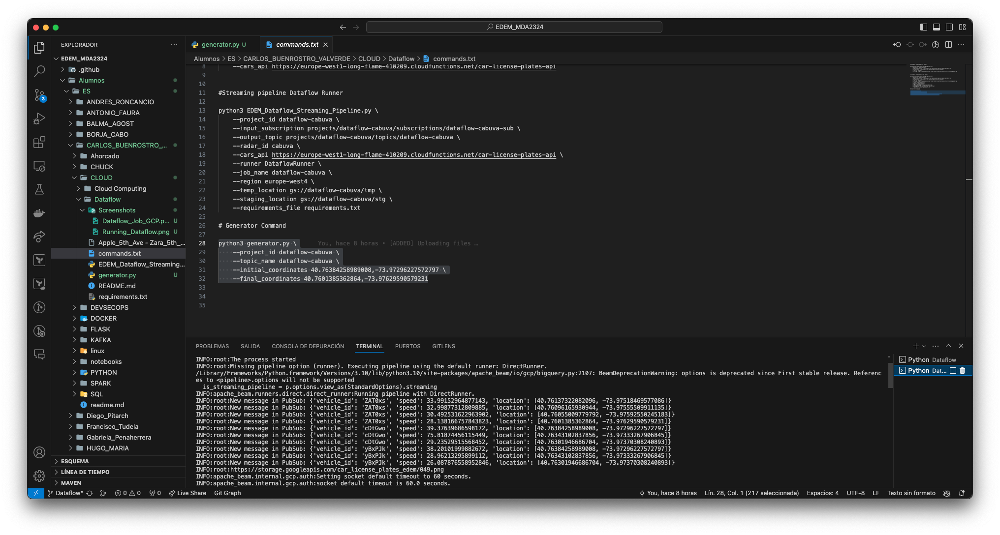
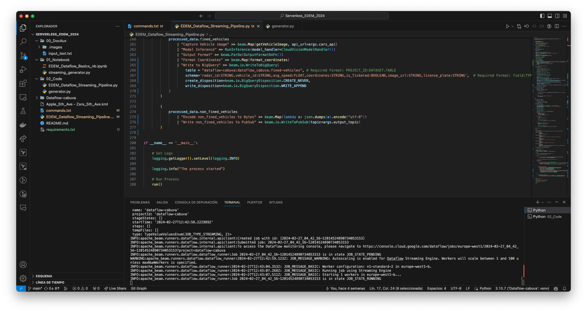
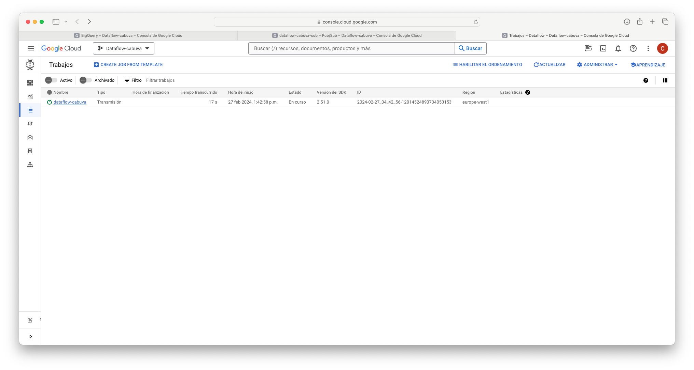
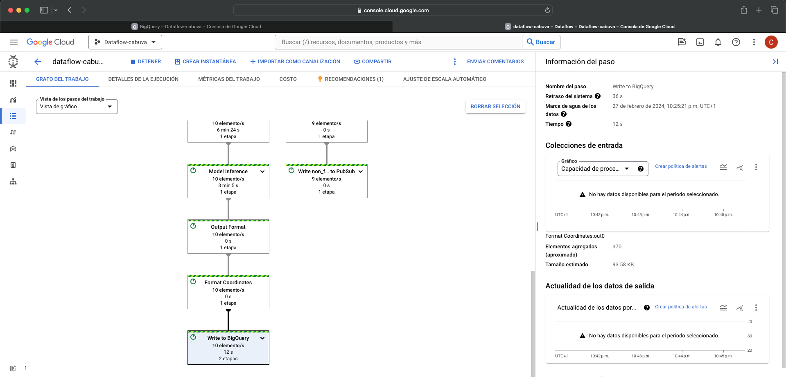
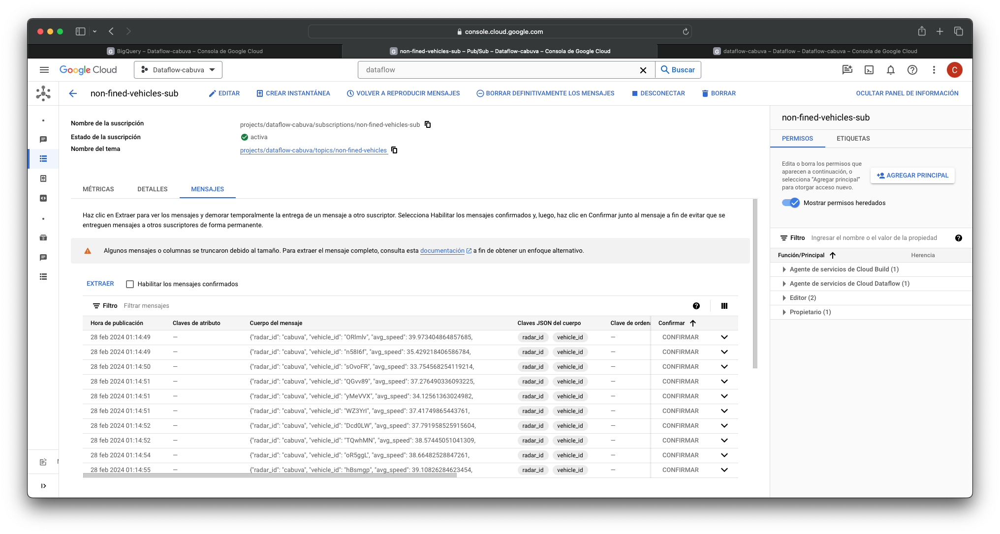
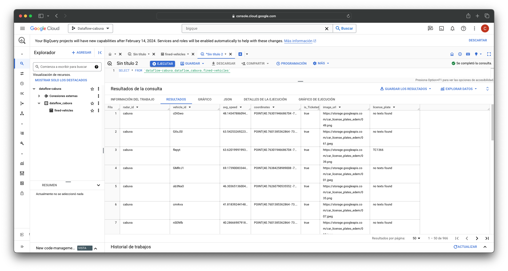

# Dataflow Postwork Carlos Buenrostro Valverde

A continuación dejaré una pequeña explicacion sobre el proceso que he seguido en el Postwork de Dataflow. Puedes encontrar capturas de pantalla de todo el proceso seguido.

Como datos complementarios, para dar un mayor realismo a la situación, con la herramienta de [Google My maps](https://www.google.com/intl/es_ES/maps/about/mymaps/), se escogió una ruta donde estaba instalado el radar. En este caso ha sido en la 5ª Avenida en un tramo que va desde la **Apple Store** hasta la tienda de **Zara**.

En primer lugar, se creó un entorno virtual con Python 10.7 en el cual se instalan las distintas dependencias de Python con el **requirements.txt**.  Además, se realizaron unos ajustes en el código ya que este tenía un pequeño fallo que provocaba error a la hora de la ejecución. Además, se incorporaron las transformaciones pertinentes para poder escribir todos los datos en una tabla de BigQuery.

En un principio, para comprobar que todo funcionaba de la forma correcta se ejecutó el generador de los coches. 

Este lo que hace es generar vehículos de forma aleatoria para después ser mandados a un topic de Pub/Sub en Google Cloud Platform (GCP en adelante).

El segundo paso fue la ejecución del Dataflow de forma local. Como se puede ver en la siguiente imagen, lee a la perfección los datos que manda el generador a Pub/Sub en GCP.  

En este caso, al tener un buen resultado, se procede a la ejecución del Dataflow a través de GCP. 

Como se puede observar en la imagen, crea sin ningún tipo de problema los workers necesarios para todo el procesamiento de los datos. 

El proceso comienza con la creación de un job en Dataflow GCP, y sigue con el procesamiento de los miles de datos datos a través del workflow que a continuación se observa. 
  

En un momento del workflow, los vehículos generados se separan en dos grupos los multados (fined-vehicles) y los no multados (non-fined vehicles). Siendo estos últimos escritos en un topic de Pub/Sub de GCP.  

Por otra parte, aquellos vehículos que sí han sido multados son formateados para su posterior escritura en BigQuery en GCP. 

Carlos Buenrostro Valverde.