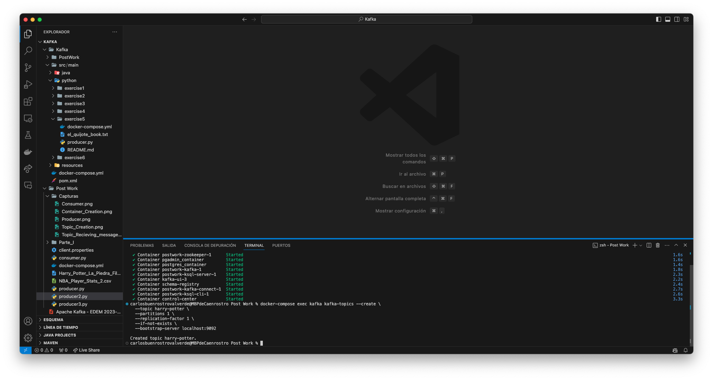

# PostWork KAFKA:

Para el siguiente entregable hemos hecho uso de un dataset obtenido de [Kaggle](https://www.kaggle.com/datasets/raunakpandey030/nba-player-stats) el cual hace referencia a las estadísticas de los multiples jugadores que han pasado por la NBA a lo largo de los años.

Como resultaba que este [archivo](./NBA_Player_Stats_2.csv) no parecía muy intuitivo para una cola de Kafka, tan sólo ha servido para enviar los mensajes a un topic creado (topic_entregable).

Para el envío de datos se han construido tanto un [producer](./producer.py) que es quien producía estos mensajes al topic "Players" mientras que el [consumer](./consumer.py) se encargaba de suscribirse al topic creado y leer los mensajes conforme llegaban al mismo.
**Envío de mensajes por parte del producer**

**Consumo de mensajes por parte del consumer**

Una vez finalizada esta primera parte, como no parecía muy intuitivo el archivo de la NBA, se decidió hacer un cambio y descargar un libro para la correcta lectura y procesos con KSQL. Para ello, se eligió el libro de [Harry Potter y la Piedra Filosofal](./Harry_Potter_La_Piedra_Filosofal.txt).

Lo primero que se realiza en esta segunda parte del PostWork es la ejecución del [docker-compose up -d](./docker-compose.yml) para levantar todos los contenedores necesarios.

Ejecutamos el [producer2.py](./producer2.py) que se encargará de mandar los datos del [archivo](./Harry_Potter_La_Piedra_Filosofal.txt) hacia el nuevo topic creado en Kafka "harry-potter". Cuando vemos que los mensajes comienzan a llegar a este nuevo topic, iniciamos KSQL mediante docker-compose exec ksql-cli ksql http://host.docker.internal:8088 para poder comenzar a trabajar sobre el texto.

**Lanzamiento KSQL**

**Creación nuevo topic**

**Consumo datos nuevo topic**

**Creación Stream**

**Palabras que empiecen por "H"**

**Palabras que tienen una longitud superior a 10 letras**

Si las imágenes insertadas en la guía no se pueden ver correctamente, puedes encontrarlas adjuntas en la carpeta **CAPTURAS**

Muchas gracias.

Carlos Buenrostro Valverde

