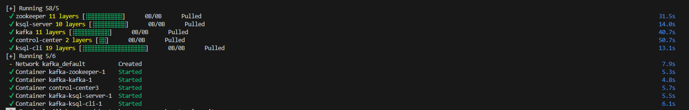
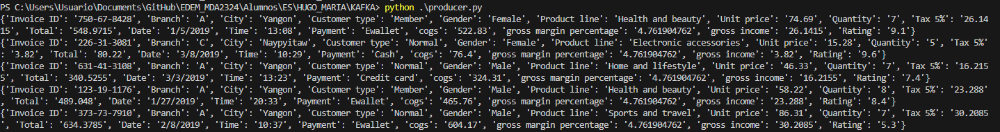
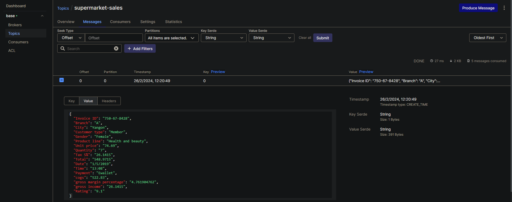
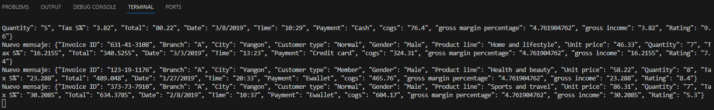
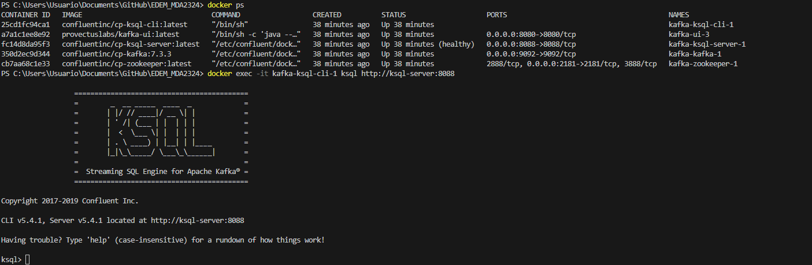
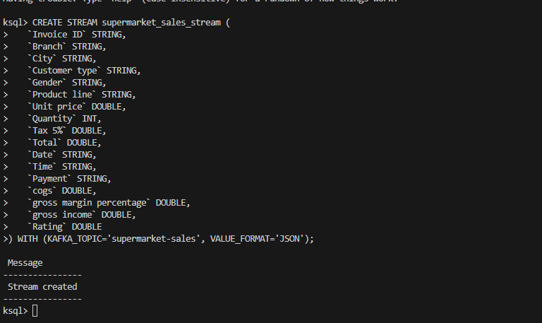
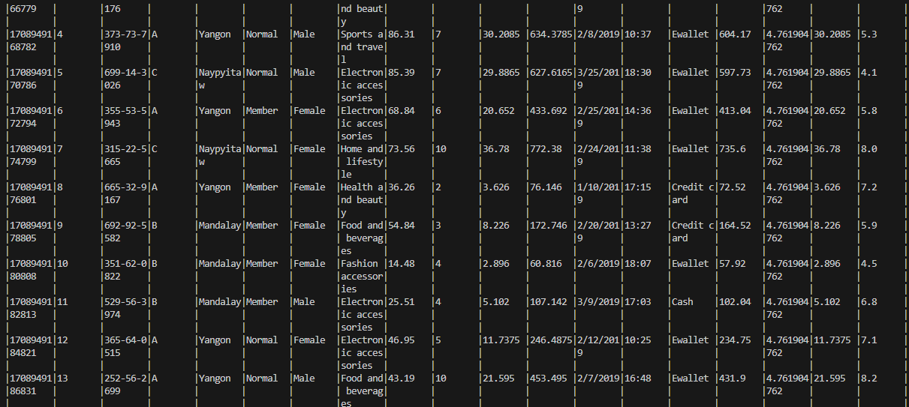

# Kafka PostWork 
primero se levanta el contenedor con el siguiente comando:

```
docker-compose up -d
```

una vez levantado, la terminal deberia verse de la siguiente manera:



## Producer
Los datos que genera el productor son un conjunto de datos que muestran el flujo de informacion dado en un supermercado

```
{
   "Invoice ID":"373-73-7910",
   "Branch":"A",
   "City":"Yangon",
   "Customer type":"Normal",
   "Gender":"Male",
   "Product line":"Sports and travel",
   "Unit price":"86.31",
   "Quantity":"7",
   "Tax 5%":"30.2085",
   "Total":"634.3785",
   "Date":"2/8/2019",
   "Time":"10:37",
   "Payment":"Ewallet",
   "cogs":"604.17",
   "gross margin percentage":"4.761904762",
   "gross income":"30.2085",
}
```

y a la hora de generar los envios la terminal se ve de la siguiente manera:



y por la UI se ve de la siguiente manera:




## Consumer

los datos son consumidos y a la hora de ejecutar el codigo y verificar si se estan consumiento los datos que llegan por el topico se ve por consola de la siguiente manera:




## KSQL

Una vez el produer y el consumer estan en funcionamiento usamos Ksql con el siguiente comando:

```
docker exec -it kafka-ksql-cli-1 ksql http://ksql-server:8088
```

por consola deberia verse de la siguiente manera:



Despues se procede a crearse las tablas necesarias para almacenar los datos:



Y por ultimo a medida que van llegando los datos veremos un output como este:




