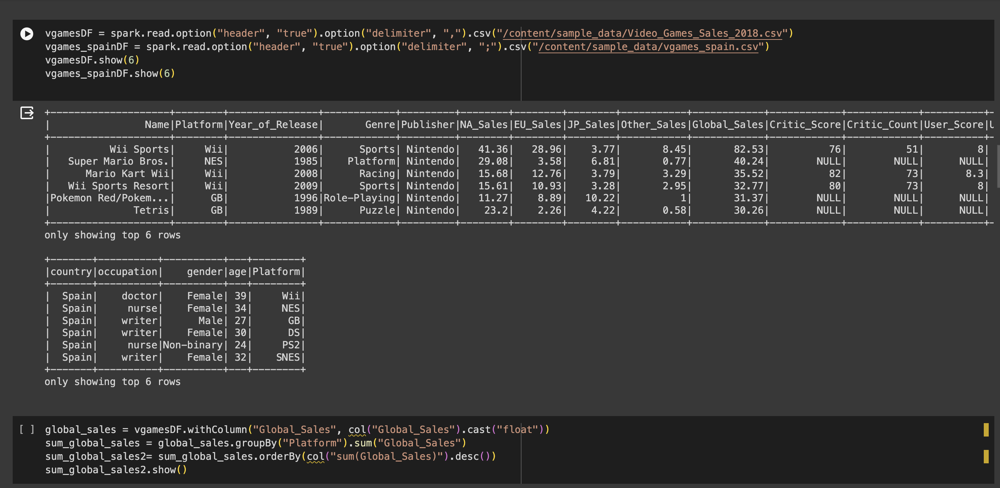
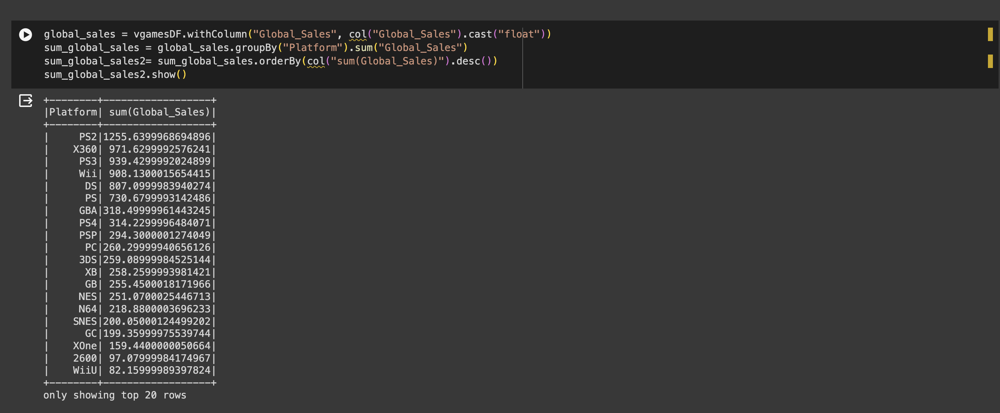
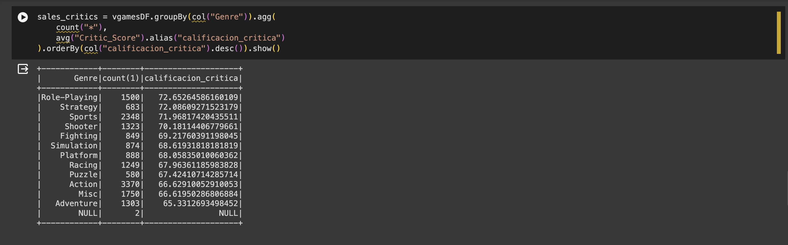
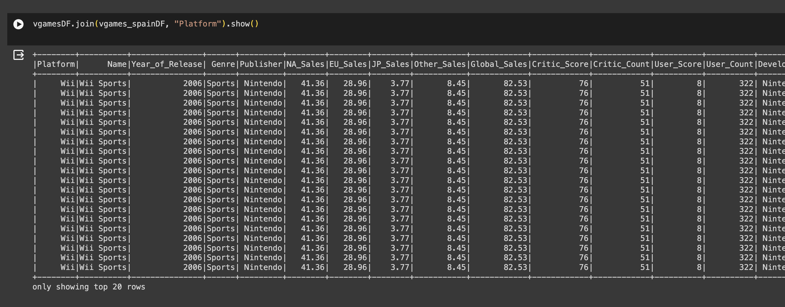
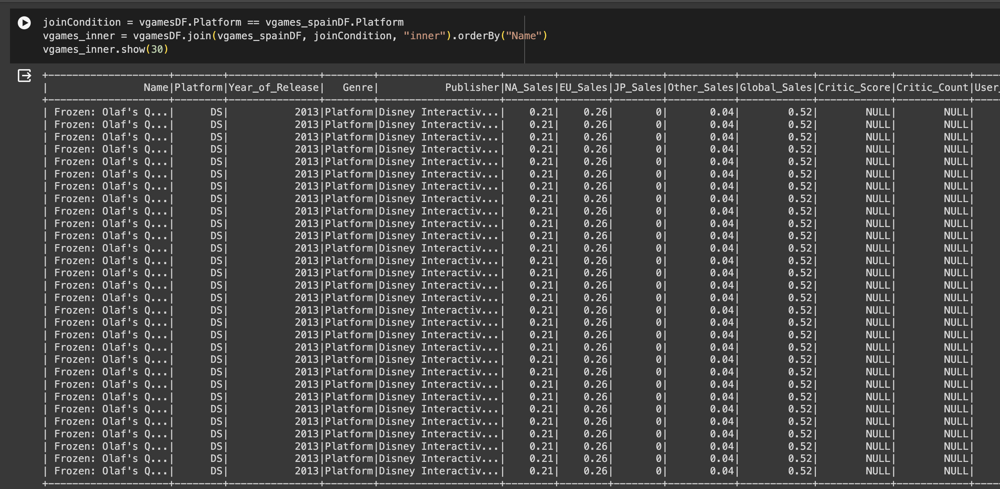

# Solucion Entregable
## Análisis de la industria de los videojuegos (2000 - 2018)

Los elementos cubiertos en este Video_Games_salesDF: La clasificación del juego basada en ventas globales bajo la columna 'Rank'. Esta métrica ofrece una perspectiva sobre cuán popular o exitoso ha sido un juego particular en comparación con otros durante su tiempo en diferentes países. Cabe señalar que la popularidad de los videojuegos puede variar enormemente de una geografía a otra debido a factores como matices culturales, preferencias de los jugadores, etc., y ventas regionales.

Análisis realizado en pyspark:

1. Críticas de ventas por género y conteo de cantidad de votos
2. Ventas globales en dólares por plataforma (xbox, PS3, PS4, etc.)
3. Join con el segundo DF (Generado con Mokaroo)
4. Inner Join.

# Sales critics by Genre and counting votes amount

# Global sales $ per Plataform(xbox, PS3, PS4, etc)

# Sales critics by genre 

# Join with second DF:

# Join 2:
