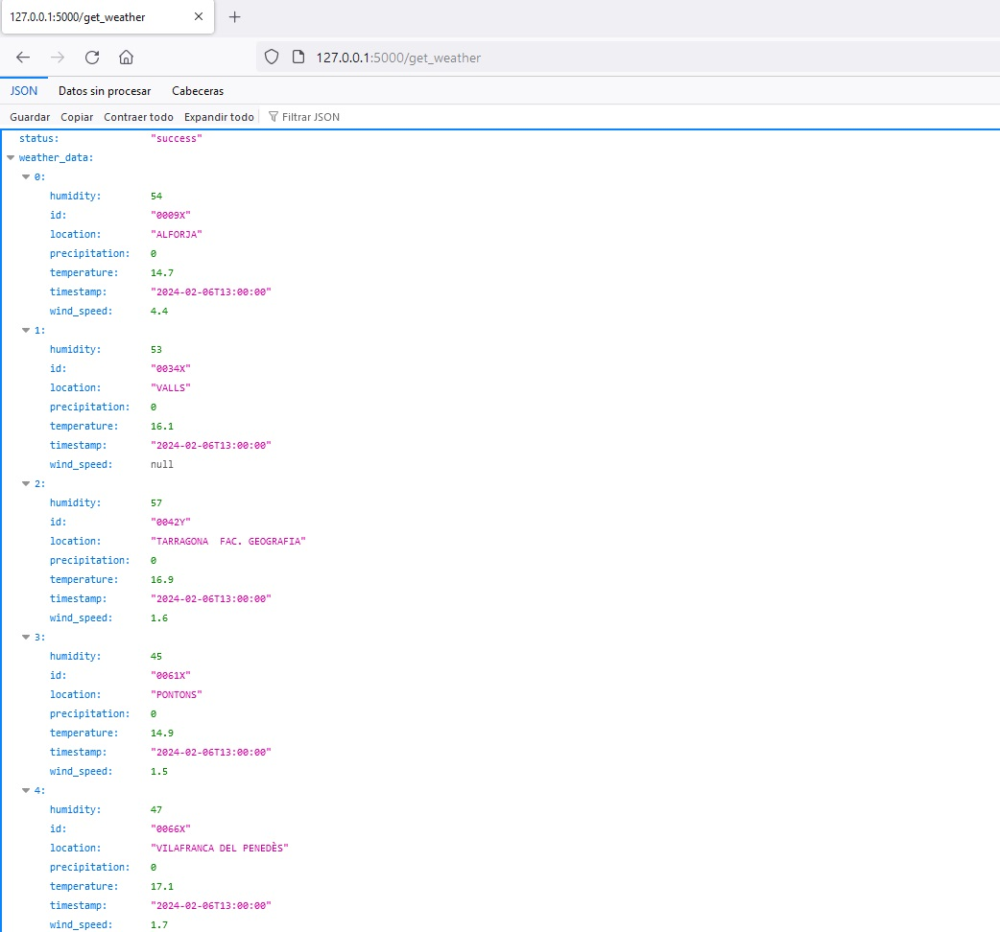
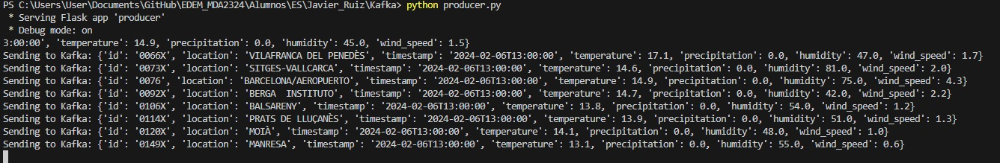
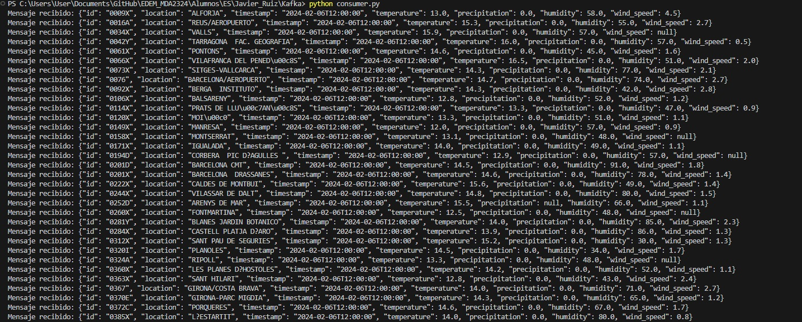
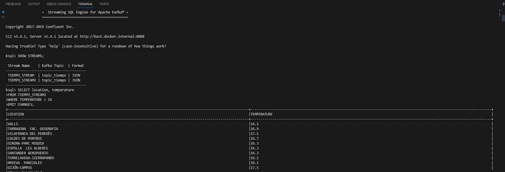
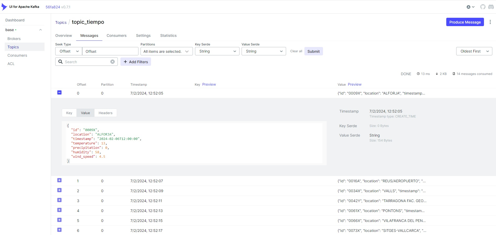

# Use Case: Weather service history (AEMET)

## Target of Application (Business Point of View): 
Provide real-time weather data processing to generate historical records, enabling better analysis and forecasting. In this brief analysis, temperature, humidity and wind speed will be examined throught differens locations from Spain.

## Architecture
    1. API-get from AEMET to get recent data of the weather conditions from Spain.
    2. Producer.py ingest the json messages into a kafka topic. Message example:    {
                                                                                    "id": "0076", 
                                                                                    "location": "BARCELONA/AEROPUERTO", 
                                                                                    "timestamp": "2024-02-06T12:00:00", 
                                                                                    "temperature": 14.7, 
                                                                                    "precipitation": 0.0, 
                                                                                    "humidity": 74.0, 
                                                                                    "wind_speed": 2.7
                                                                                    }
    3. Kafka server (where kafka topic is <topic_tiempo>)
    4. Consumer.py consum these messages.
    5. KSQL server to make KSQL queries

Also for process visualization and better understanding, I included a kafka-ui container.

## Evidences of the Application running

### API-get to AEMET working fine

### Producer running, terminal output

### Consumer running, terminal output

### Making queries with KSQL

## Extra
### Visualizing producer in Kafka UI

