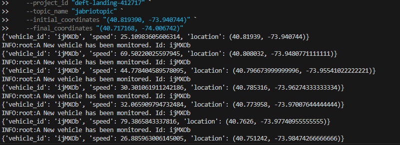
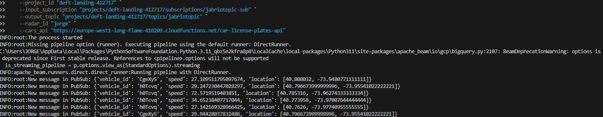
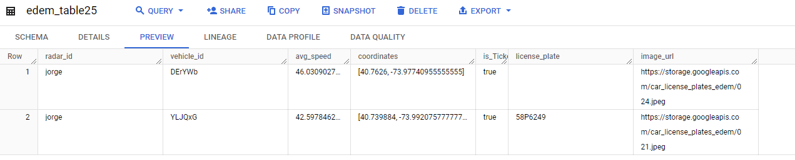

# GOOGLE CLOUD - DATAFLOW

## CAPTURAS DE PRUEBA

- Generador

[](./img/gen.png)

- DataFlow

[](./img/df1.png)

- BigQuery Tabla

[](./img/bq.png)

## CÓDIGOS DE EJECUCIÓN

- Generador
```powershell
python3 generator.py `
    --project_id "id" `
    --topic_name "topic" `
    --initial_coordinates "(40.819390, -73.940744)" `
    --final_coordinates "(40.717168, -74.006742)"
```
- Dataflow Pipeline
```powershell
python3 EDEM_Dataflow_Streaming_Pipeline.py `
    --project_id "id" `
    --input_subscription "projects/id/subscriptions/sub" `
    --output_topic "projects/id/topics/topic" `
    --radar_id "jorge" `
    --cars_api "car-api"
```