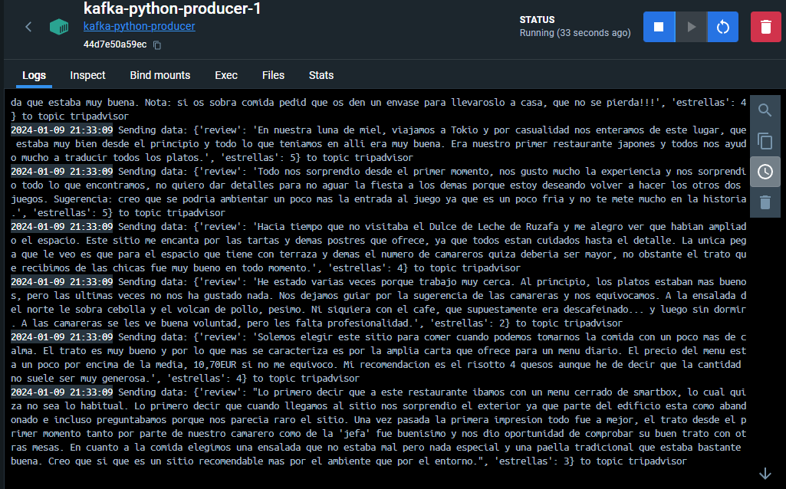
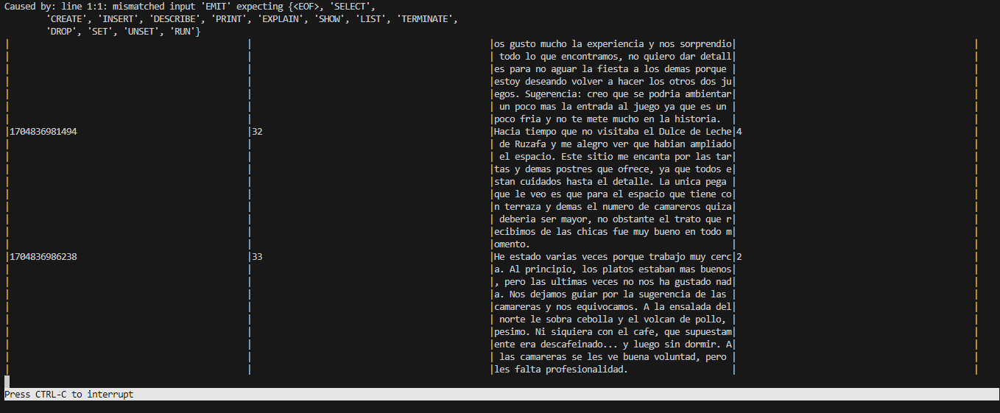
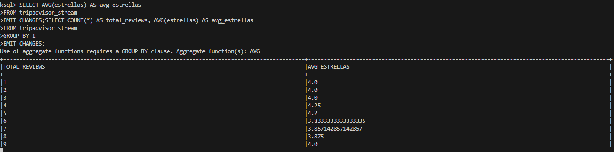

# KAFKA POSTWORK
Para este ejercicio, he decidido adoptar el rol de cualquier empresa que utilice Tripadvisor para obtener calificaciones.

Tras un código de scraping web que no voy a compartir aquí por que no viene al caso con el ejercicio, somos capaces de extraer la información de cualquier elemento en Tripdavisor. En este caso nos hemos enfocado en un usuario aleatorio, pero podría haber sido cualquier hotel o restaurante. El json tiene la forma:

```json
{
  "reviews": [
    {
      "restaurante": "X",
      "titular": "X",
      "review": "X",
      "fecha_visita": "X",
      "estrellas": 1
    }
```
Al usar símbolos españoles, he tenido que usar unidecode para formatear el texto a utf-8 sin problemas más allá de la mala gramática de las reviews.

Cada vez que se produce una review, se actualiza el json (reviews.json), que posteriormente es analizado por producer.py y enviado a kafka. Se envía la reseña y las estrellas del cliente. De esta forma es más fácil poder sacar conclusiones mediante el uso de queries en KSQL.

Para usar en local, emplea producer.py y consumer.py, simple y sencillo.


Ya en docker, ejecuta el comando
```docker
docker-compose up -d
```
y posteriormente el consumer_docker.py para escuchar.



## KSQL
Ejecutamos KSQL gracias al contenedor de docker, creamos un stream tripadvisor que lee el topic del producer, con el fin de guardar los datos en un dataframe.



Y LUEGO PODEMOS YA EJECUTAR LAS QUERIES QUE QUERAMOS, EN ESTE CASO HE HECHO UNA SIMPLE YA QUE MI DATBASE NO DA MUCHO JUEGO:
```ksql
SELECT COUNT(*) AS total_reviews, AVG(estrellas) AS avg_estrellas
FROM tripadvisor_stream
GROUP BY 1
EMIT CHANGES;
```
El resultado:

