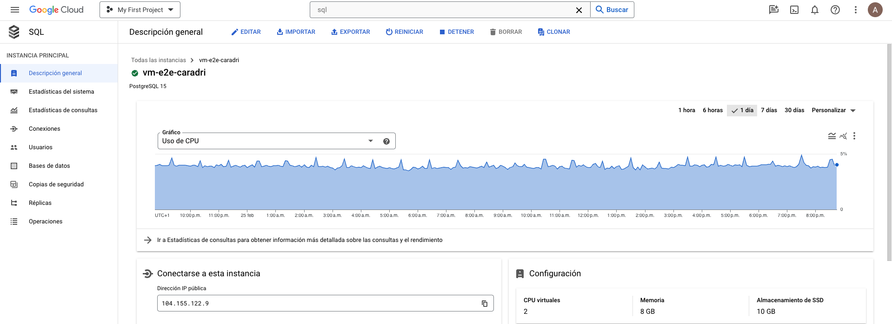

# Caso de uso

Cada tienda de comestibles, que opera con sus propios procesos internos, proporcionará datos transaccionales que se almacenarán en nuestro almacenamiento de objetos. Por lo tanto, se requiere que los procesos internos de cada tienda de abarrotes cuenten con los permisos necesarios para ejecutar esta acción.

Implemente una arquitectura basada en eventos , asegurando que los datos se almacenen inmediatamente en las tablas respectivas. La solución debe optimizarse en términos de utilización de recursos y rentabilidad.

Dada la familiaridad de nuestro equipo de datos con Postgres como base de datos, es la opción preferida para este proyecto.

El panel final debe exponerse como un servicio para permitir el acceso a diferentes equipos.

La arquitetcura planteada era la siguiente:

    

El trabajo se realizaba en parejas, con cada persona encargada de una parte. La entrega será explicada en detalle de acuerdo a esta dinámica colaborativa.

# Proyecto 1

Creaba una maquina virtual y una cuenta de servicio.

    

Además el project 1 era el encargado de ejecutar el generador desde la VM. Similaba los datos de ultrmarinos.

# Proyecto 2

Nuestra BBDD:

    

Proxy de Cloud SQL:

    

La BBDD en google cloud:

    

Artifact registry:

    

Cloud Run:

    

Grafana:

    

