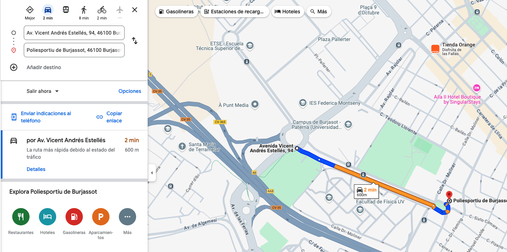

# Entraga trabajo Cloud

A continuación se adjunta imagenes del trabajo entregable de cloud.

# Caso de uso


*Retos empresariales*
  
- Cada cámara se instalará en un tramo concreto y deberá calcular la velocidad media de cada vehículo.
- La velocidad promedio en el tramo no deberá exceder las 25 millas por hora (40 km/h).
- Se debe capturar una imagen , obtener el número de placa y almacenar la foto analizada de todos los vehículos multados.
  
*Requisitos del caso*

- Los datos captados por las diferentes cámaras deberán ser enviados al tema previsto durante la clase para la adecuada visualización de los datos.

- Los datos también deben almacenarse en el Data Warehouse para su posterior análisis por parte del equipo de Analistas. [Asignación de tareas] .

- El mensaje de notificación de multas ahora debería incluir la URL del Google Cloud Storage Bucket donde se almacena la imagen del vehículo , para verificar que el modelo ha capturado correctamente el texto de la matrícula. [Tarea (opcional)] .

# Arquitectura

<p align="center">
    
</p>

# Generador 

Vamos usar una API para que nosotros le digamos la calle y nos devuelva la coordenada incial y final. Teniendo en cuenta estas coordenadas ejecutara en generador.

<p align="center">
    
</p>

Ejecutamos directamente el siguiente comando, este script le pasa las coordenadas al generador y este envia datos al topic de PubSub.

```
python run.py
```

En la siguiente imagen vemos los datos en el topic:

<p align="center">
    
</p>


Insertamos en BIG Query, en la tabla *Camara_raw* la información que tenemos en PubSub:

<p align="center">
    
</p>

# Dataflow fined and not fined

Para ejecutar el dataflow escribimos por consola el siguiente código:

```
python Pipeline.py \
    --project_id woven-justice-411714  \
    --input_subscription projects/woven-justice-411714/subscriptions/camara-input2-sub \
    --output_topic projects/woven-justice-411714/topics/camara-fined-out \
    --radar_id AdrianaC \
    --cars_api https://europe-west1-long-flame-410209.cloudfunctions.net/car-license-plates-api
```

<p align="center">
    
</p>


Insertamos en la tabla *Camara_fined* la información que tenemos en PubSub filtrando solo los fined.

<p align="center">
    
</p>

Insertamos en la tabla *Camara_non_fined* la inforamcion que tenemos en PubSub filtrando solo los non fined.

<p align="center">
    
</p>


# Big Query Output

En la columna image_url podemos ver la imagen del coche.

<p align="center">
    
</p>

<p align="center">
    
</p>