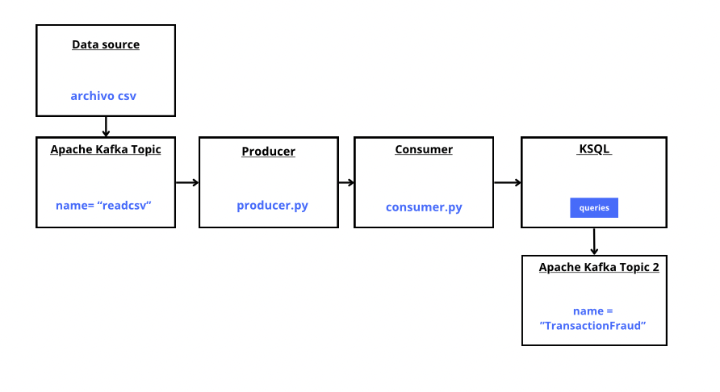
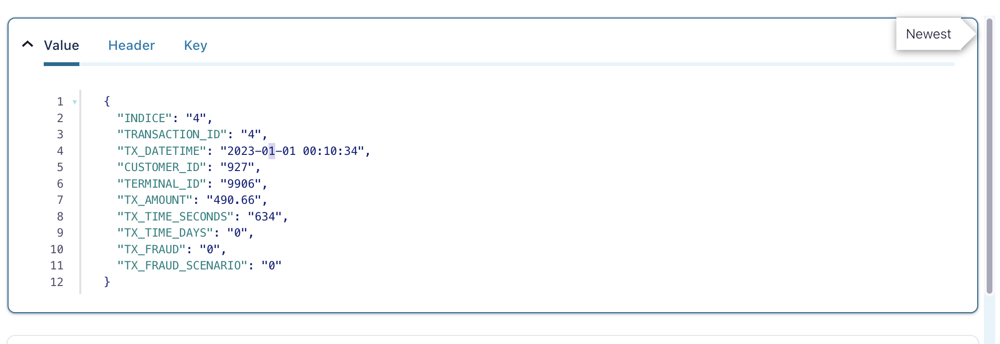
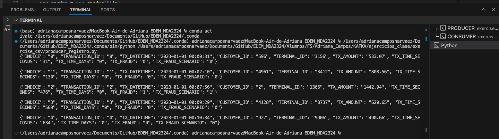
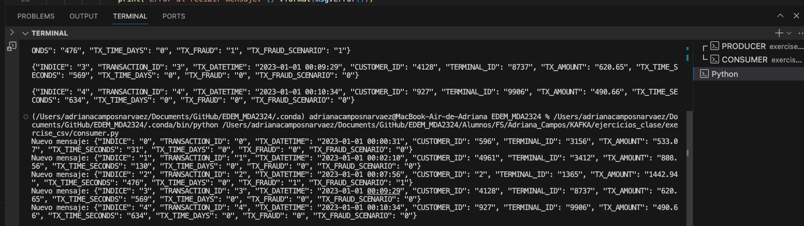
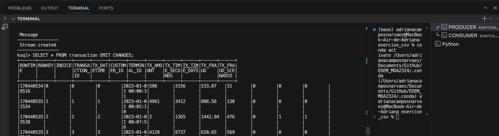
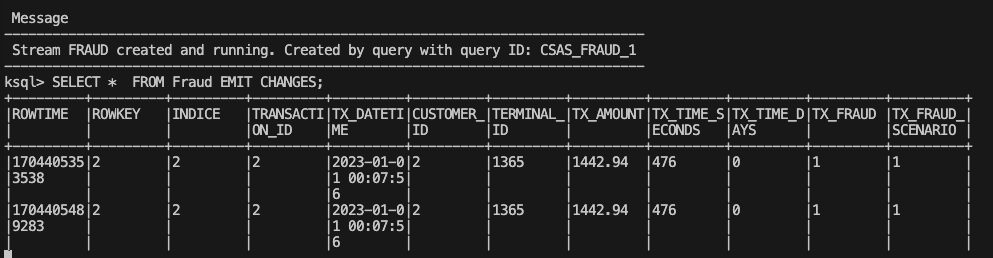
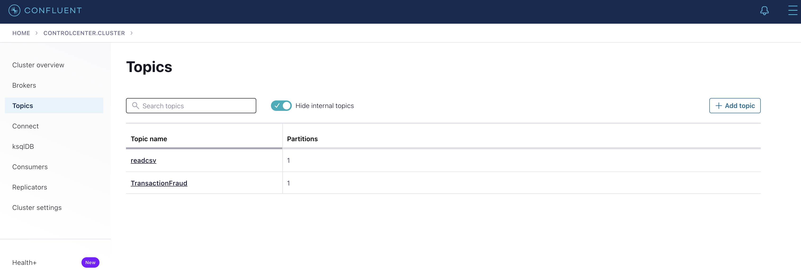
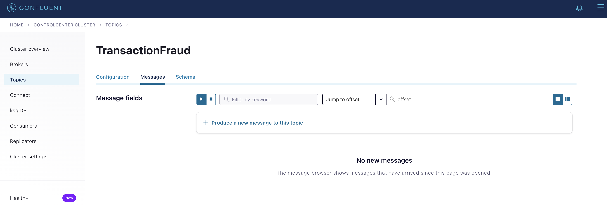

## Entregable FAFKA

Explicación básica de:

1. Caso de uso

Iniciar el proceso adquiriendo un conjunto de datos que incluya transacciones fraudulentas, el cual constituirá la fuente principal para el análisis. Utilizando Kafka como plataforma de gestión de datos, se envían estas transacciones a un **topic**. Posteriormente, se implementa un consumidor Kafka para la lectura activa de estos datos.

Finalmente, se lleva a cabo un análisis basicó y se crea un nuevo **topic** exclusivamente destinado para las transacciones identificadas como fraudulentas. Este enfoque integral agiliza el flujo de información desde la adquisición del conjunto de datos hasta la gestión especializada de transacciones fraudulentas en un entorno eficiente y tiempo reducido.

2. Conjunto de datos seleccionado 
   

El conjunto de datos original consta de 1,75 millones de transacciones realizadas considerando usuarios simulados a través de varios terminales durante todo el período comprendido entre enero de 2023 y junio de 2023. Sin embargo, los datos están muy desequilibrados, con solo un pequeño porcentaje (0,1345%) de las transacciones clasificadas como fraudulentas. En mi caso de uso he cogido 650 regístros.

Debido a la distribución desigual de las clases en el conjunto de datos, es más apropiado evaluar el rendimiento del modelo utilizando AUPRC en lugar de la precisión de la matriz de confusión. La precisión de la matriz de confusión puede ser engañosa en casos de desequilibrio de clase.

3. Arquitectura final implementada 
   

    

4. Ejemplos json de su modelo json de datos 
   

    

5. **Evidencia** de que la Aplicación se ha ejecutado de extremo a extremo proporcionando los resultados esperados. Con capturas de pantalla de los diferentes pasos: 
   
1) La ingesta
   
2) El productor
   

    

3) El procesamiento con un Consumidor

    

4) El procesamiento con KSQL, la impresión final en pantalla sobre el resultado esperado.

    

5) El nuevo stream

    

## Preguntas 

¿Como puedo hacer que en el topic **TrasactonFraud** de confluent en el apartado mensajes salgan los datos del stream?

    

    

