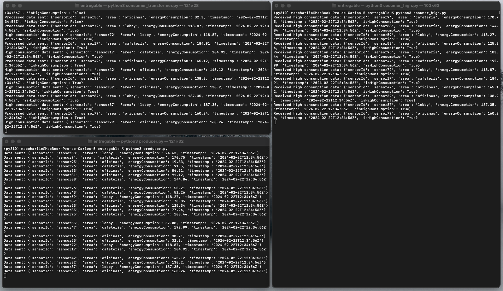

### Caso de Uso: Análisis de Consumo Energético
El objetivo es monitorear y analizar el consumo energético en diferentes áreas de un edificio para identificar patrones de uso, detectar posibles problemas de eficiencia energética y tomar decisiones informadas para optimizar el consumo y reducir costos.

#### Dataset:
Se recopilan datos de sensores distribuidos en diversas áreas del edificio, que registran el consumo energético en intervalos regulares. Estos datos se envían a través de Kafka a un tópico llamado `iot_sensor_data`.

#### Arquitectura Implementada:
1. **Generación de Datos:** Se emplea un script de Python que simula la generación de datos de consumo energético. Este script crea datos simulados que representan lecturas de sensores en áreas específicas del edificio, como oficinas, lobby y cafetería. Los datos se envían al tópico `iot_sensor_data` de Kafka a través de un productor Kafka.

2. **Procesamiento y Transformaciones:** Se emplea un script que actua como consumer del topic anterior, para poder hacer transformaciones. En este caso de uso lo que queremos es identificar aquellos momentos de recogida de datos donde el gasto energético es mayor a 100, lo cual se identifica como un gasto alto. Este transformador envia los datos a dos topics, uno llamado `processed_iot_data` que recoge todos los datos, ya sean altos en gasto o no y otro `high_consumption_data` que recoge únicamente los que son altos, como función de "alarma".

3. **Procesamiento con KSQL:** Se utiliza KSQL para procesar los datos en tiempo real y calcular el consumo energético promedio por área en intervalos ficticios de una hora. Se crea una consulta KSQL que agrupa los datos por área, calcula el promedio de consumo de energía y emite los resultados en una tabla. Donde podemos ver cuantos datos de que area hemos recogido, la media del área en cuanto a consumo y cuantos momentos ha tenido con un alto gasto energético.

#### Imagen de la Arquitectura:

#### Imagen en Acción:

Aquí podemos observar tanto el productor, como el consumidor y transformador en acción, leyendo los datos, y dividiendolos en los topics según convenga.

#### Puesta en Marcha KSQL:

Para ver los resultados de la tabla de KSQL tendremos que meternos en el contenedor de docker en este caso que contiene el Cliente de KSQL.

Para crear la tabla primero necesitaremos un stream que lea los datos del topic `processed_iot_data`

Posteriormente crear la tabla que haga las agrupaciones y transformaciones

Aqui la tabla en acción, con el ROWKEY de cada mensaje, el área del mensaje de gasto energético, cuantos datos de cada área tenemos y cuantos de esos tiene un gasto alto de energía y la media hasta el momento de gasto energético de cada área.

