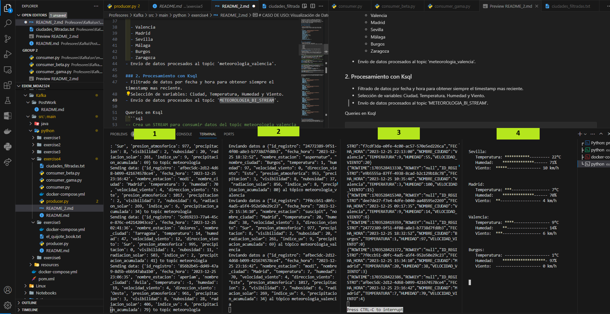
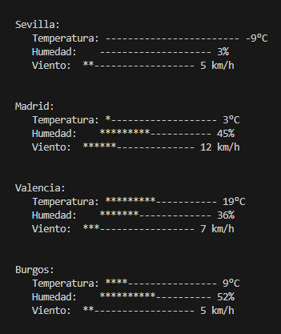

# CASO DE USO: Visualización de Datos Meteorológicos en Tiempo Real con Kafka

Este aplicativo se enfoca en la adquisición, procesamiento y visualización en tiempo real de datos meteorológicos (ficticios) procedentes de diversas estaciones meteorológicas de España. Utilizando Apache Kafka como infraestructura de mensajería, el flujo de trabajo se divide en cuatro etapas para obtener información específica de ciudades seleccionadas.

## Arquitectura del proceso



### 1. Adquisición de Datos:

- [producer.py](producer.py) 
- Generación de datos aleatorios a través de la librería Faker.
- Transmisión de datos al topic de Kafka llamado 'meteorologia'.

```json
{
  "id_registro": "f3c6bc82-7c9d-4a61-b40c-ddfad23d0b1c",
  "fecha_hora": "2023-12-25 21:39:11",
  "nombre_estacion": "sturno",
  "nombre_ciudad": "Pontevedra",
  "temperatura": -10,
  "humedad": 44,
  "velocidad_viento": 18,
  "direccion_viento": "Norte",
  "presion_atmosferica": 981,
  "precipitacion": 12,
  "visibilidad": 10,
  "nubosidad": 76,
  "radiacion_solar": 378,
  "indice_uv": 6,
  "precipitacion_acumulada": 23
}

```
### 2. Filtrado y Enrutamiento:
- [consumer.py](consumer.py)
- Consumo de datos del topic 'meteorologia'.
- Filtrado para seleccionar información de ciudades seleccionadas: 
  
  - Valencia
  - Madrid
  - Sevilla
  - Málaga
  - Burgos
  - Zaragoza
- Envío de datos procesados al topic 'meteorologia_valencia'.

```json
[
  {
    "topic": "meteorologia_valencia",
    "data": {
      "id_registro": "5382a617-35d0-4722-9040-55a9ecd5c3bd",
      "fecha_hora": "2023-12-26 08:24:58",
      "nombre_estacion": "nihil",
      "nombre_ciudad": "Madrid",
      "temperatura": -10,
      "humedad": 78,
      "velocidad_viento": 16,
      "direccion_viento": "Este",
      "presion_atmosferica": 1009,
      "precipitacion": 19,
      "visibilidad": 6,
      "nubosidad": 74,
      "radiacion_solar": 978,
      "indice_uv": 7,
      "precipitacion_acumulada": 47
    }
  },
  {
    "topic": "meteorologia_valencia",
    "data": {
      "id_registro": "50369919-fc31-4aca-b5a1-924bec36e73f",
      "fecha_hora": "2023-12-26 10:49:58",
      "nombre_estacion": "rerum",
      "nombre_ciudad": "Burgos",
      "temperatura": 23,
      "humedad": 40,
      "velocidad_viento": 7,
      "direccion_viento": "Sur",
      "presion_atmosferica": 977,
      "precipitacion": 0,
      "visibilidad": 4,
      "nubosidad": 72,
      "radiacion_solar": 421,
      "indice_uv": 3,
      "precipitacion_acumulada": 44
    }
  },
  {
    "topic": "meteorologia_valencia",
    "data": {
      "id_registro": "30ac9271-4e0a-44c1-8505-74b989b577cc",
      "fecha_hora": "2023-12-26 02:14:39",
      "nombre_estacion": "recusandae",
      "nombre_ciudad": "Sevilla",
      "temperatura": 23,
      "humedad": 55,
      "velocidad_viento": 18,
      "direccion_viento": "Este",
      "presion_atmosferica": 1019,
      "precipitacion": 19,
      "visibilidad": 1,
      "nubosidad": 70,
      "radiacion_solar": 431,
      "indice_uv": 9,
      "precipitacion_acumulada": 91
    }
  }
]

```

### 3. Procesamiento con Ksql
- Filtrado de datos por fecha y hora para obtener siempre el timestamp mas reciente.
- Selección de variables: Ciudad, Temperatura, Humedad y Viento.
- Envío de datos procesados al topic 'METEOROLOGIA_BI_STREAM'.

Queries en Ksql
 ```sql
-- Crea un STREAM para consumir datos del topic meteorologia_valencia
CREATE STREAM meteorologia_stream (id_registro STRING, fecha_hora STRING, nombre_ciudad STRING, temperatura INT, humedad INT, velocidad_viento) WITH (KAFKA_TOPIC='meteorologia_valencia', VALUE_FORMAT='JSON');

-- Crea una tabla temporal con los registros más recientes para cada id_registro y nombre_ciudad
CREATE TABLE meteorologia_temporal AS
SELECT id_registro, nombre_ciudad, MAX(fecha_hora) AS fecha_hora
FROM meteorologia_stream
GROUP BY id_registro, nombre_ciudad;

-- Seleccion de variables y filtrado para obtener solo los datos más recientes de cada ciudad
CREATE STREAM METEOROLOGIA_BI_STREAM WITH (VALUE_FORMAT='JSON') AS
SELECT m.id_registro, m.fecha_hora, m.nombre_ciudad, m.temperatura, m.humedad, m.velocidad_viento
FROM meteorologia_stream m
INNER JOIN meteorologia_temporal t
ON m.id_registro = t.id_registro;

-- Envia datos transformados al topic METEOROLOGIA_BI_STREAM
CREATE STREAM METEOROLOGIA_BI_STREAM_FINAL WITH (VALUE_FORMAT='JSON') AS
SELECT * FROM METEOROLOGIA_BI_STREAM;

```

Estructura de datos en el topic METEOROLOGIA_BI_STREAM luego de la transformación solo con las variables seleccionadas y los datos mas recientes.

```json
[
  {
    "ROWTIME": 1703517663471,
    "ROWKEY": "null",
    "ID_REGISTRO": "9b6464ab-b4ed-4028-b3e3-c2d822770c05",
    "FECHA_HORA": "2023-12-25 20:02:14",
    "NOMBRE_CIUDAD": "Madrid",
    "TEMPERATURA": 8,
    "HUMEDAD": 94,
    "VELOCIDAD_VIENTO": 10
  },
  {
    "ROWTIME": 1703517633408,
    "ROWKEY": "null",
    "ID_REGISTRO": "2a8d87a8-6639-49a9-bc69-22f2829701db",
    "FECHA_HORA": "2023-12-25 19:11:53",
    "NOMBRE_CIUDAD": "Burgos",
    "TEMPERATURA": -1,
    "HUMEDAD": 46,
    "VELOCIDAD_VIENTO": 1
  },
  {
    "ROWTIME": 1703517635410,
    "ROWKEY": "null",
    "ID_REGISTRO": "32375e6f-e094-4fd1-acbc-1523db581a36",
    "FECHA_HORA": "2023-12-25 22:31:45",
    "NOMBRE_CIUDAD": "Valencia",
    "TEMPERATURA": 5,
    "HUMEDAD": 83,
    "VELOCIDAD_VIENTO": 2
  },
  {
    "ROWTIME": 1703517663471,
    "ROWKEY": "null",
    "ID_REGISTRO": "2f1e70a9-c423-4b41-a436-0218b11a5069",
    "FECHA_HORA": "2023-12-25 20:02:14",
    "NOMBRE_CIUDAD": "Sevilla",
    "TEMPERATURA": 8,
    "HUMEDAD": 94,
    "VELOCIDAD_VIENTO": 10
  },
  {
    "ROWTIME": 15065177638914,
    "ROWKEY": "null",
    "ID_REGISTRO": "9b6464ab-b4ed-4028-b3e3-c2d822770c05",
    "FECHA_HORA": "2023-12-25 23:08:11",
    "NOMBRE_CIUDAD": "Maálaga",
    "TEMPERATURA": 5,
    "HUMEDAD": 77,
    "VELOCIDAD_VIENTO": 4
  },
  {
    "ROWTIME": 456651778838314,
    "ROWKEY": "null",
    "ID_REGISTRO": "f3c6bc82-7c9d-4a61-b40c-ddfad23d0b1c",
    "FECHA_HORA": "2023-12-25 23:07:06",
    "NOMBRE_CIUDAD": "Saragoza",
    "TEMPERATURA": 4,
    "HUMEDAD": 57,
    "VELOCIDAD_VIENTO": 4
  }
]


```

### 4. Visualización en Tiempo Real:
- [consumer_beta.py](consumer_beta.py)
- Consumo de datos desde el tema 'METEOROLOGIA_BI_STREAM'.
- Generación de visualizaciones dinámicas para obtener una representación gráfica actualizada de las condiciones meteorológicas.

