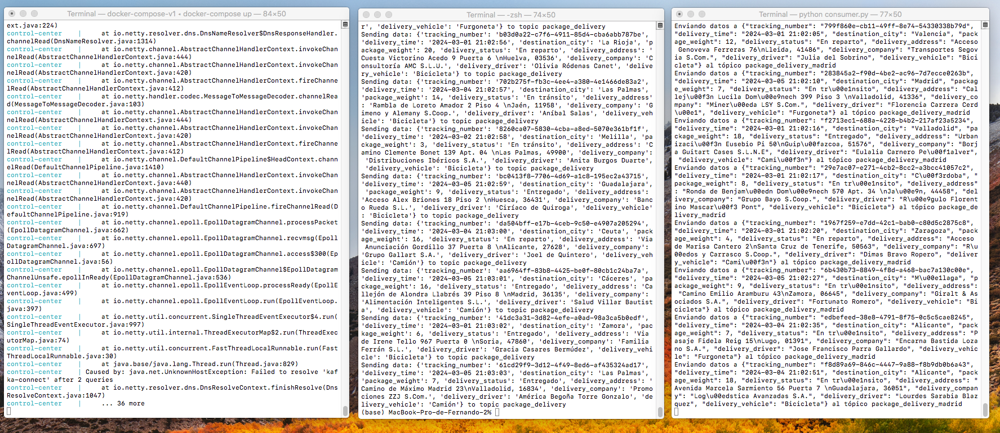
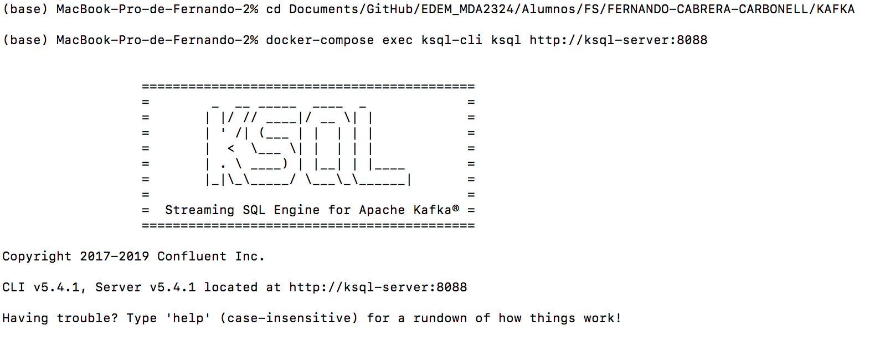
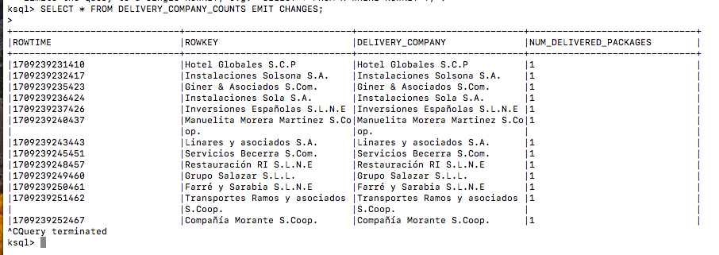
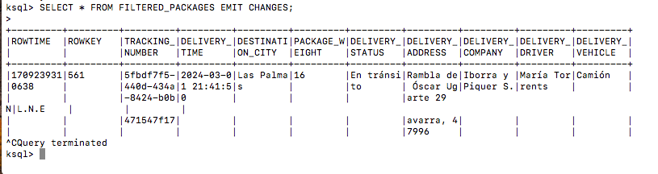
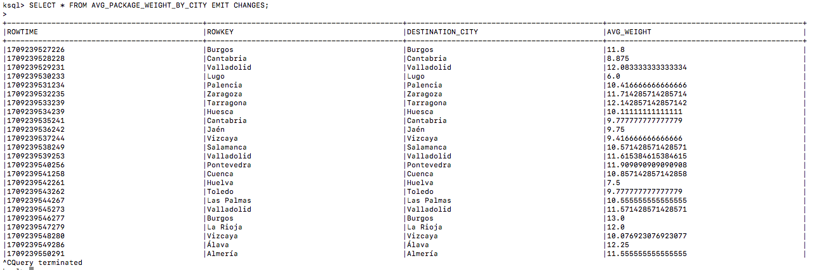

# CASO DE USO: Seguimiento de entrega de paquetes con Kafka

Este caso de uso se centra en la gestión, seguimiento y análisis de la entrega de paquetes a través de algún tipo de plataforma de envíos.
Tenemos la captura, procesamiento y visualización de datos relacionados con los paquetes entregados, incluyendo detalles como el número de paquetes entregados por cada empresa de envío, la identificación de paquetes entregados en ciertas ciudades o la distribución del peso medio de los paquetes entregados en cada.

Las ciudades han sido generadas aleatoriamente para seleccionar 20 ciudades de España:
- Córdoba
- Valladolid
- Alicante
- Palma de Mallorca
- Elche
- La Coruña
- Las Palmas de Gran Canaria
- Bilbao
- Hospitalet de Llobregat
- Gijón
- Barcelona
- Murcia
- Zaragoza
- Madrid
- Valencia
- Sevilla
- Vigo
- Málaga
- Vitoria
- Granada

## Ejecución

Abrimos tres terminales diferentes para ejecutar el proceso.

### 1. docker-compose.yml

Configuramos y ejecutamos los servicios necesarios.
```
docker-compose up
```

### 2. producer.py

Enviamos datos relacionados con la entrega de paquetes.
```
python producer.py
```

Ejemplo de datos enviados:

```
Sending data: {'tracking_number': 'b2f834b0-78f6-461f-821d-0ff277df9c39', 'delivery_time': '2024-03-01 21:49:09', 'destination_city': 'Córdoba', 'package_weight': 18, 'delivery_status': 'Entregado', 'delivery_address': 'Camino de Magdalena Murillo 6 Puerta 1 \nAlbacete, 28141', 'delivery_company': 'Promociones Iberia S.L.', 'delivery_driver': 'Leonor Serrano-Verdejo', 'delivery_vehicle': 'Bicicleta'} to topic package_delivery
```

### 3. consumer.py

Recibimos datos relacionados con la entrega de paquetes.
```
python consumer.py
```

Ejemplo de datos enviados:

```
Enviando datos a {"tracking_number": "10df4520-4f06-4fc4-bcb6-0f21b488d74d", "delivery_time": "2024-03-05 21:49:03", "destination_city": "La Coru\u00f1a", "package_weight": 20, "delivery_status": "Entregado", "delivery_address": "Glorieta de Edu Montero 119 Apt. 99 \nLa Rioja, 31077", "delivery_company": "Comercializadora Cabanillas & Asociados S.C.P", "delivery_driver": "Samuel Torrens Pi", "delivery_vehicle": "Bicicleta"} al tópico package_delivery_madrid
```

## Capturas proceso



## Procesamiento en KSQL



```
docker-compose exec ksql-cli ksql http://ksql-server:8088
```

Vamos a hacer tres consultas diferentes:

- Contar cuántos paquetes entregados hay por cada empresa de envío.
  Veremos el nombre de la empresa de envío y la cantidad de paquetes enviados por cada una en tiempo real.
- Filtrar los paquetes enviados a Las Palmas con detalle de envío.
  Veremos todos los detalles de los paquetes que tienen de destino la ciudad de Las Palmas.
- Calcular el peso medio de los paquetes entregados en cada ciudad.
  Veremos la ciudad de destino y el peso medio de los paquetes entregados en cada ciudad en tiempo real.

Para esto hemos creado 3 tablas diferentes:

## delivery_company_counts

```
CREATE TABLE delivery_company_counts AS
>SELECT delivery_company, COUNT(*) AS num_delivered_packages
>FROM package_delivery_stream
>WHERE delivery_status = 'Entregado'
>GROUP BY delivery_company;
>

 Message                                                                                                           
------------------------------------------------------------------------------------------------
 Table DELIVERY_COMPANY_COUNTS created and running. Created by query with query ID: CTAS_DELIVERY_COMPANY_COUNTS_2 
------------------------------------------------------------------------------------------------
```

## filtered_packages

```
CREATE STREAM filtered_packages AS
>SELECT *
>FROM package_delivery_stream
>WHERE destination_city = 'Las Palmas' AND package_weight >= 5;
>

 Message                                                                                                
------------------------------------------------------------------------------------------------
 Stream FILTERED_PACKAGES created and running. Created by query with query ID: CSAS_FILTERED_PACKAGES_3 
------------------------------------------------------------------------------------------------
```

## avg_package_weight_by_city

```
CREATE TABLE avg_package_weight_by_city AS
>SELECT destination_city, AVG(package_weight) AS avg_weight
>FROM package_delivery_stream
>GROUP BY destination_city;
>

 Message                                                                                                                 
------------------------------------------------------------------------------------------------
 Table AVG_PACKAGE_WEIGHT_BY_CITY created and running. Created by query with query ID: CTAS_AVG_PACKAGE_WEIGHT_BY_CITY_5 
------------------------------------------------------------------------------------------------
```

Y ya podemos hacer las 3 consultas:

```
SELECT * FROM DELIVERY_COMPANY_COUNTS EMIT CHANGES;
```


```
SELECT * FROM FILTERED_PACKAGES EMIT CHANGES;
```


```
SELECT * FROM AVG_PACKAGE_WEIGHT_BY_CITY EMIT CHANGES;
```

