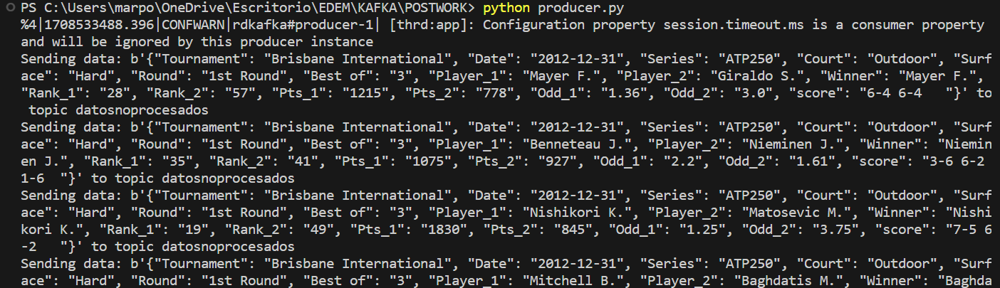
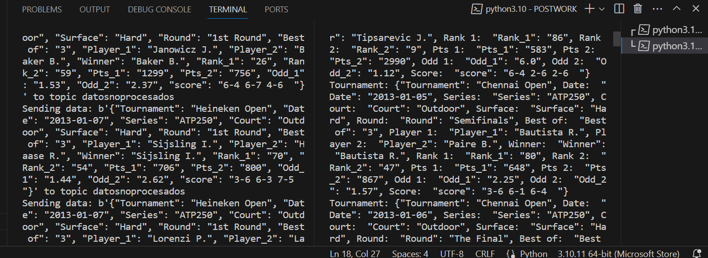
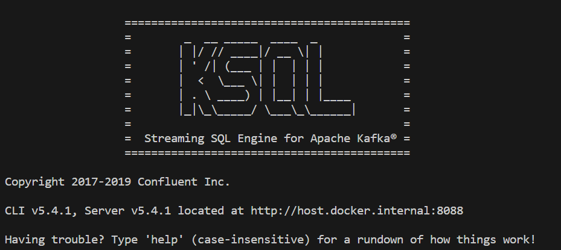
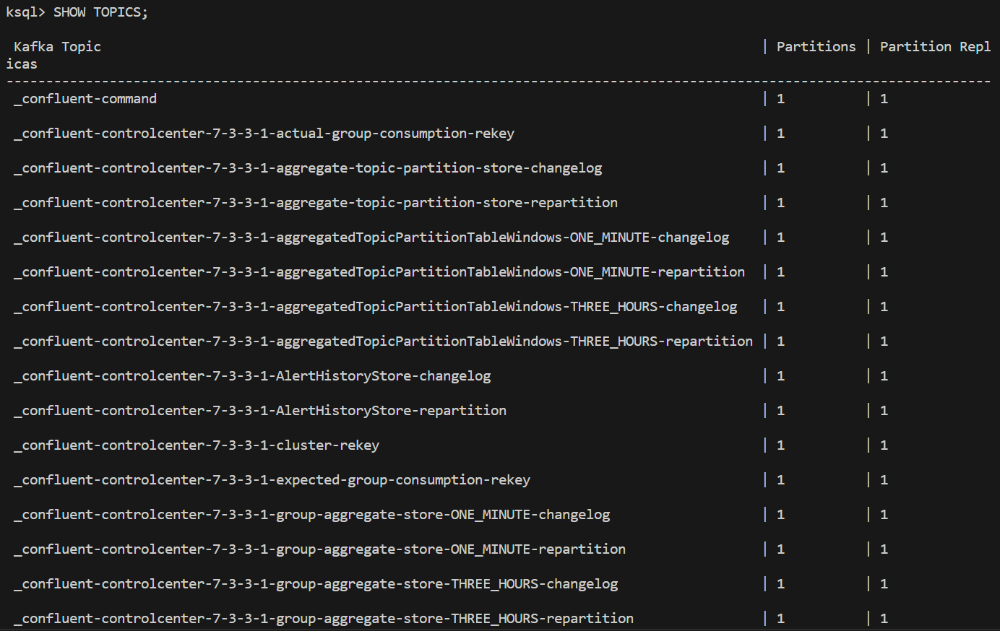
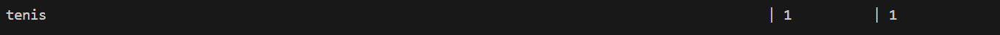

1. Definición del Caso de Uso:

Desde un Punto de Vista Empresarial: El objetivo de nuestra aplicación es analizar datos históricos de partidos de tenis para obtener información sobre el rendimiento de los jugadores, la dinámica de los torneos y los patrones de apuestas. Al procesar estos datos, las partes interesadas en la industria del tenis, como jugadores, entrenadores, analistas y agencias de apuestas, pueden tomar decisiones informadas sobre estrategias de jugador, programación de torneos y ajustes de cuotas de apuestas.

2. Conjunto de Datos Seleccionado:

Utilizaremos un conjunto de datos que contiene información sobre partidos de tenis, incluidos detalles como nombre del torneo, fecha, serie, tipo de cancha, superficie, ronda, formato del partido, nombres de los jugadores, ganador, clasificaciones de los jugadores, puntos, cuotas y resultado final.

3. Arquitectura Final Implementada:

Fuente de Datos (Partidos de Tenis) -> Productor de Kafka -> Tema de Kafka (Datosnoprocesados) -> Consumidor (Procesamiento de Datos) -> Tema de Kafka (DatosnoProcesados) -> Procesamiento con KSQL -> Tema de Kafka (Datosprocesados) -> Consumidor (Visualización Final)

5. Evidencia de la Ejecución de la Aplicación:

Capturas de pantalla de los diferentes pasos:

Ingestión de Datos: 

Procesamiento con el Consumidor: 

Procesamiento con KSQL: 

Esta arquitectura permite el análisis integral de datos de partidos de tenis, proporcionando información valiosa para diversas partes interesadas dentro de la industria del tenis.