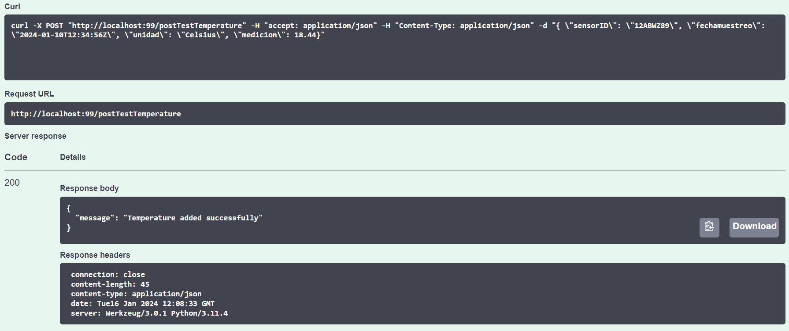
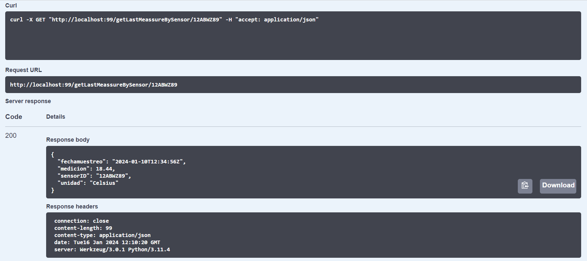
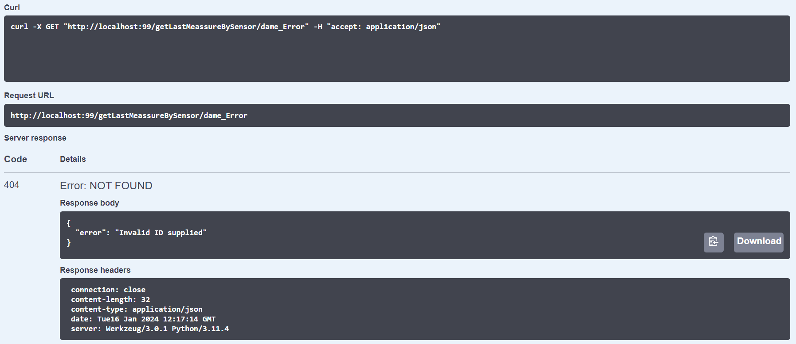

# Evaluation Exercise - Create your first API using swagger

El ejercicio consiste en crear una api que devuelva las mediciones de temperatura de un sensor que funciona en tiempo real. 

El metodo GET debe tener la siguiente estructura: 

/getLastMeassureBySensor/{sensor}

code (id del sensor) - string
fechamuestreo - string
unidad - string
medicion - number

Para probar que funciona correctamente la api se ha creado tambien el metodo POST para intorducir a mano datos de testing. 

Método POST:

Método GET:

Introducir un sensorID inexistente:

