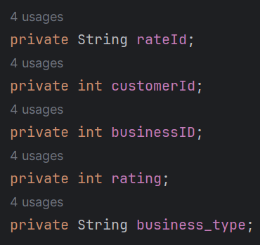

# Kafka Post Work: Data Processing with Kafka end to end.

## Real-time Hotel and Restaurant Ratings Platform with Kafka

In this project, random users will rate various hotels and restaurants (utilizing two different topics), and the reviews for the hotels will be continuously updated.

### Arquitecture scheme

### Input Data

The producer will produce Random Data which consists of a Rate class.
This class have this values:

Each rate is uniquely identified by a rateID. 
The rating is a numerical value from 1 to 10, representing the customer satisfaction. 
The businessType specifies whether the rate is associated with a 'Hotel' or a 'Restaurant'.

### Producer
As we have seen before the producer produce a random Rate data witch is transformed into a JSON with the class RateJsonSerializer, 
and it sends the data to a Consumer with the topic "reviews".

Note: We could send it with different topics from here but I wanted to simulate that we receive the data from an unknown provider. 

### Consumer
The consumer reads the values sent by the producer. 
After deserializing the JSON, it filters out incorrect data. 
In this context, the numeric rating is expected to fall within the range of 1 to 10. 
Any ratings outside of this range are not processed.
Once the rating is validated, it identifies the type of business and resends it to specialized topics, in this case, 
the topics are 'restaurants' and 'hotels'.

### Reviews Per Hotel
In this section, we adeptly handle comprehensive hotel information sourced from the 'hotels' topic. 
We showcase the continuously updated ratings of hotels through a streaming process.

### KSQL examples
topics:

Reviews of the customer 1:

Number of reviews of each restaurant:

## Conclusion

In this project, a review production and consumption system has been developed using Apache Kafka. The producer generates random data for hotel and restaurant reviews in JSON format. This data is consumed by a program that filters and validates the reviews, sending them to specialized topics ('restaurants' and 'hotels'). Subsequently, hotel information is managed, and the updated hotel ratings are streamed seamlessly. The implementation aims to adeptly handle comprehensive data processing and provide a seamless presentation of hotel ratings in real-time.

Note: This is a Beta version, the objective is to learn how to use apache kafka in java.

