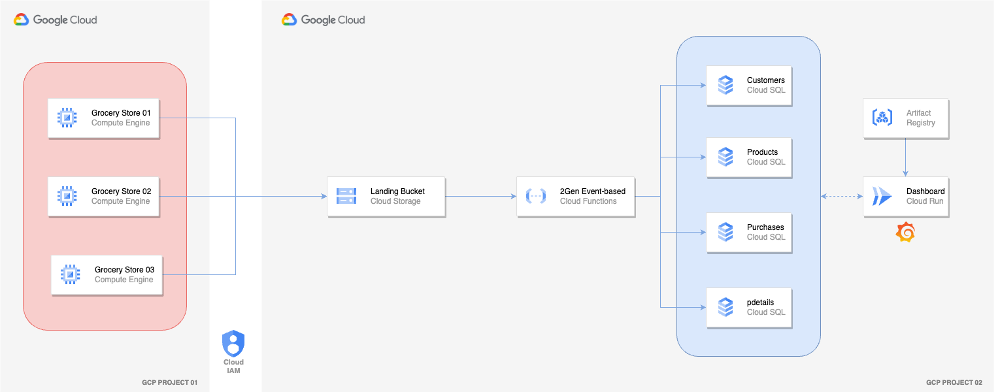

# Cloud Computing EDEM 2024 
Cloud Computing Architectures | EDEM 2024

- Weekday Group Professor: [Miguel Moratilla](https://github.com/mimove)
- Weekend Group Professor: [Javi Briones](https://github.com/jabrio)

## **00** Setup Requirements

**GCP**
- [Google Cloud Platform - Free trial](https://console.cloud.google.com/freetrial)
- [Install Cloud SDK](https://cloud.google.com/sdk/docs/install)

**AWS**
- [Amazon Web Services - Free trial](https://aws.amazon.com/free)
- [Install AWS CLI](https://aws.amazon.com/cli)
  
## Cloud Computing Event-Driven Architecture

#### Case description

As members of the Data team at Whole Foods Market, we have been assigned the task of developing a dashboard to monitor purchases made in three of our grocery stores.

#### Case Requirements

- Each grocery store, operating with its own internal processes, will provide transactional data to be stored in our object storage. Therefore, it is required that each grocery store's internal processes have the **necessary permissions** to execute this action.

- Implement an **event-driven architecture**, ensuring that data is immediately stored in the respective tables. The solution should be **optimized** in terms of resource utilization and cost-effectiveness.

- Given the familiarity of our Data team with **Postgres** as a Database, it is the preferred choice for this project.

- The final dashboard should be **exposed as a service** to allow different teams access.

#### Data Architecture

#### Deployment instructions
The exercise will be carried out **in pairs** in two different GCP projects to work on permission granting.

- Check [here](https://github.com/jabrio/Cloud_Computing_EDEM_2024/blob/main/README.md) for the necessary steps to deploy this architecture.
- [Code](https://github.com/jabrio/Cloud_Computing_EDEM_2024/tree/main/01_Code/02_Event_Driven_Architecture)

## **03** Extra Exercise (Homework Assignment)

As the management team spends a significant amount of time traveling, they need to receive the most important KPIs via email each time a grocery store updates its data. To achieve this, it is requested that a **Cloud Function be triggered every time our tables are updated**, allowing the sending of an email with detailed information.

## **04** Bibliography & Additional Resources (GCP)

- IAM
    - https://cloud.google.com/iam/docs/service-accounts-create
    - https://cloud.google.com/iam/docs/understanding-roles

- VM
    - https://cloud.google.com/compute/docs/instances/create-start-instance 

- Cloud SQL
    - https://cloud.google.com/sql/docs/postgres/create-instance
    - https://cloud.google.com/sql/docs/postgres/connect-auth-proxy

- Cloud Functions
    - https://cloud.google.com/functions/docs/console-quickstart

- Artifact Registry
    - https://cloud.google.com/artifact-registry/docs/repositories/create-repos

- Cloud Run
    - https://cloud.google.com/run/docs/deploying
    - https://cloud.google.com/sql/docs/postgres/connect-run
