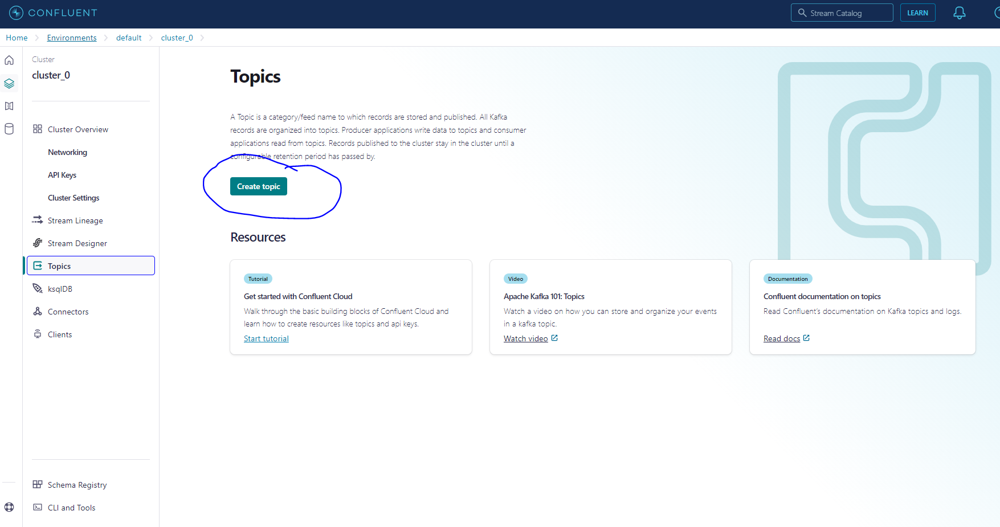
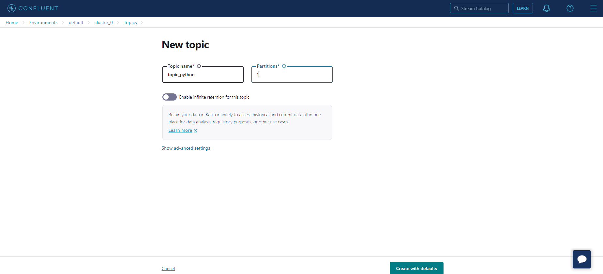
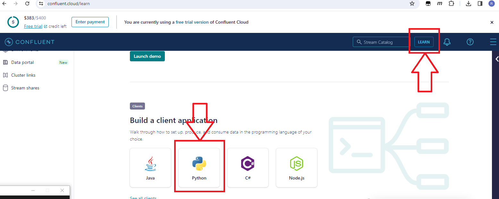
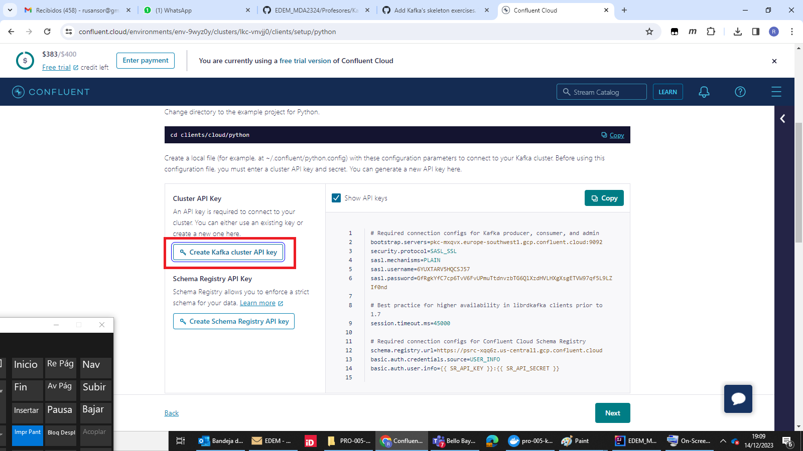
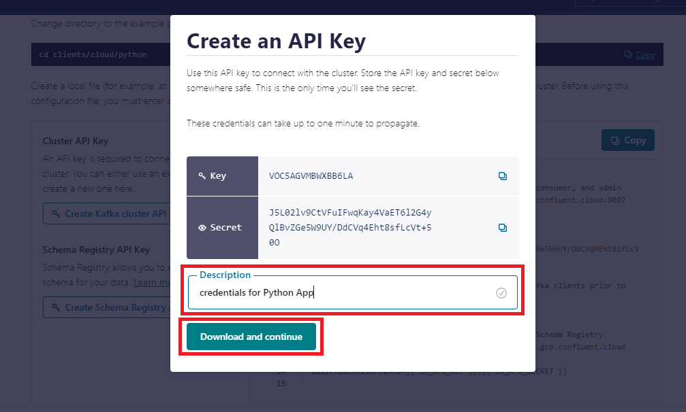
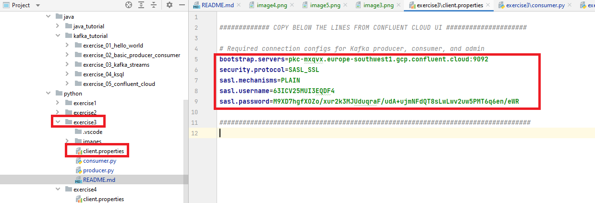

# Exercise 3: Python App to Cloud

## Target
Send messages from your computer, from a Python App, messages to Confluent Kafka Cloud.

## Steps

We will now create the topic to which we will send the messages. Click on the "Topics" tab on the left side of the screen and then click on "Create Topic".
   

<br><br>

Change the Topic name to "topic_java" and the Partitions to 1. Click on Create with defaults.
   


## Python App

### Python libraries installation
Before running the example, you need to install the python kafka client library:

```sh
$ pip install kafka-python
$ pip install confluent_kafka
```
<br><br>

### Set up Python credentials from Confluent Cloud
Click "Learn" button. Then Click on Python image.


<br><br>

Once you choose an environment/cluser. you will be shown a screen with instructions. You only need generate a new API 
access key:


<br><br>
Enter a description and save the credentials in your computer.



<br><br>

### Modify Apo Python to use your new API credentials
Modify the file client.properties and put your credentials.


### Run the python scripts 
Execute the Consumer: run the script consumer.py
Execute the Producer: run the script producer.py


#### Exercises 

* Modify the python Producer script (producer.py) and send different messages. Verify in the Confluent topic's Cloud
* and in the Python Consumer App that the new messages arrive.
* 
* Use a messages more complex than a String. For example a JSON message like this one => {"name":"John", "age": 26} 
where you can increment the message JSON attribute "age" number in each sent message.
* 
* Create a new topic in Confluen Cloud. Adapt the Produce and Consumer Python Apps to use this new topic. Test it 
* end to end.

